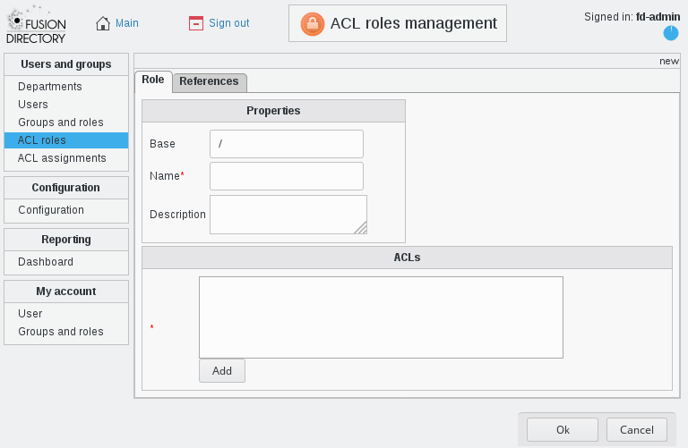
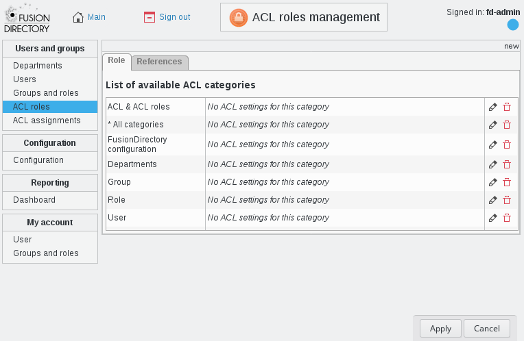
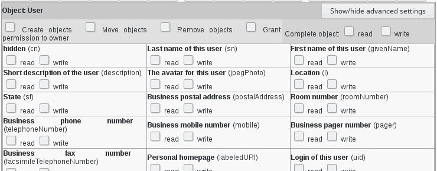
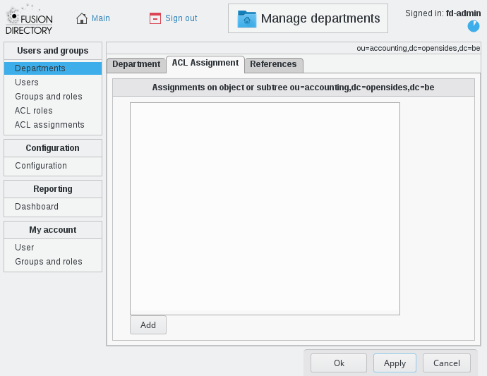
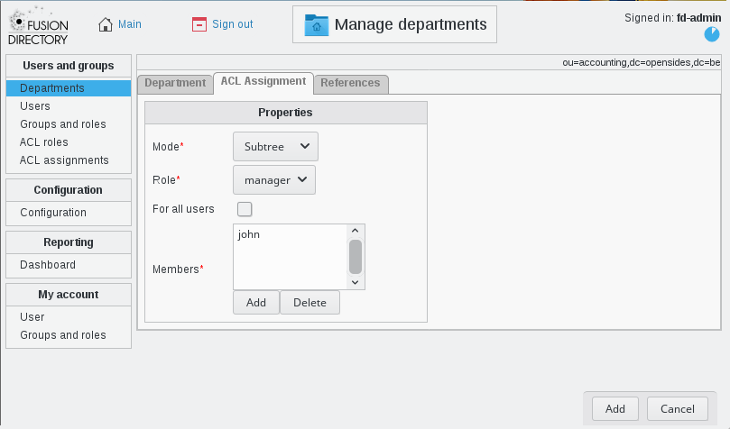
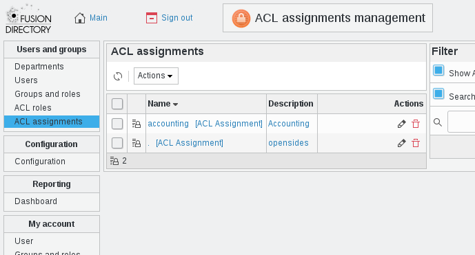
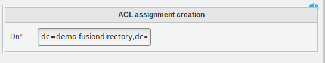

Howto use ACLs
--------------

To give rights to users, the first step is to define an ACL role which will list the permissions you want to give.
The second step is to assign this role to the users concerned, on the base you want to give rights on.

Create ACL role
================

Now let’s get more into the details of which kind of permission an ACL role can give.
Go to ACL roles and create a new one.

Fill name and description as you see fit.\\
Click **Add** to add some ACL rights in this role, you will see a screen listing the ACL categories:

Most categories should match an object type, some may match several or a whole plugin instead.\\
Let’s edit rights on **Users** category for instance, you should see a "Object: User" part first which manage rights on user main tab.
Giving **Create** right on this part will give the right to create users. For read/write, you can give global rights on the whole tab or you can expand the advanced settings and control read/write rights field by field:

Then you have a part for each user tab depending on your installed plugins. The **Create** right on a tab allows to activate it while the **Remove** one allows to deactivate.\\
The **Grant permission to owner** checkbox allows to give rights only on the user’s own node as in the editowninfos role we used earlier.

Special cases about rights
__________________________

Template
........

The template part is available for objects which support templates and allow to give rights on templates, and control rights on the template_cn field.

To be able to create a user using a template, the connected user needs:

* Read right of user/template:template_cn on the template object (or any parent department)

* Create right of user/user on the base the user is created in (or any parent department)

* Write right of the fields required by the templates on the base the user is created in (or any parent department)

Snapshot
........

Starting from FD 1.3, there is a Snapshot part for objects which supports snapshots.

* Create right means the user will be able to take new snapshots

* Delete right means he will be able to delete existing snapshots

* Write right on restore_over field means he will be able to restore snapshots of an existing object

* Write right on restore_deleted field means he will be able to restore snapshots of deleted objects

Assign ACL role to users concerned by department
================================================

So, let’s say you want to give all rights on users from the branch **ou=accounting,dc=example,dc=com** to the user **John Smith**.\\
Start by going to the **Departments** page by clicking it in the left menu.\\
Then open the department named accounting and go to the **ACL Assignments** tab.

  - Click **Add** (under ACL assignment field)
  - Select role manager
  - Select mode subtree
  - Click **Add** (under members field) and select John Smith in the dialog
  - Click **Add** (bottom right)
  - Click **Ok**

It’s done. You can now see that this assignment shows up in ACL assignments, which allows you to manage existing assignments and modify them.

Advanced options
================

Assignement mode
________________

ACL assignment mode defines the scope of the ACL. 

Following modes are available:

* **Subtree**: The ACL will be valid for all sub departments. In other words, if this ACL is assigned to the LDAP base, it will be active on the complete LDAP directory.

* **Base only**: Assigns the set of ACLs to one single object. This may be useful in rare cases. (Note that you can activate the ACL assignment tab for all object in the configuration screen. You can also create assignments on arbitrary DNs from the ACL assignments page. Use with care.)

Assignement with DN
___________________

You can also go to the acl assignement option and go to action and create a new assignement

