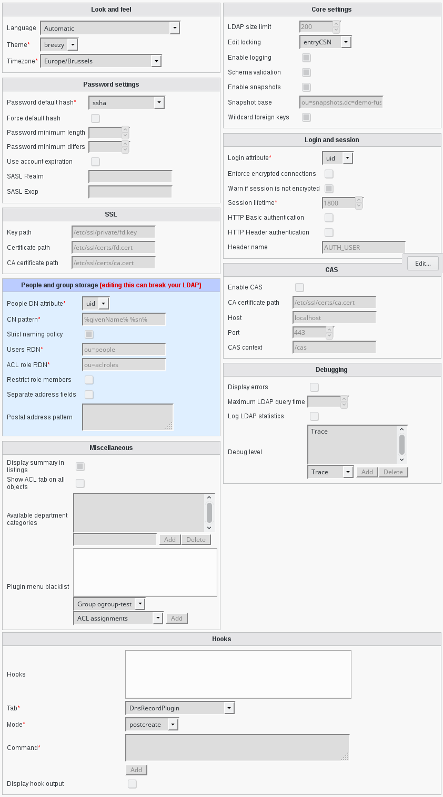

Configuration
-------------

All the configuration is stored inside the ldap, in FusionDirectory branch.

If you need to modify something, you can access to FD configuration by the "Configuration" entry in the "Addons" section of the main menu.

You need to click on "Edit" first to access edition and then "Ok" once you’ve finished.

Look and feel
^^^^^^^^^^^^^

* **Language**: Defines the default language used by FusionDirectory. Normally FusionDirectory autodetects the language from the browser settings. If this is not working or you want to force the language, just modify the language here.
* **Theme**: (required) Defines what theme is used to display FusionDirectory pages. You can install some corporate identity like theme and/or modify certain  templates  to fit your needs within themes.
* **Timezone**: (required) Defines the timezone used within FusionDirectory to handle date related tasks, such as password expiration, vacation messages, etc. The timezone value should be a unix conform timezone value like in /etc/timezone.

Core settings
^^^^^^^^^^^^^

* **LDAP size limit**: Tells FusionDirectory to retrieve the specified maximum number of results. The user will get a warning, that not all entries were shown.
* **Edit locking**: Enables FusionDirectory to check if a entry currently being edited has been modified from someone else outside FusionDirectory in the meantime. It will display an informative dialog then. It can be set to *entryCSN* for OpenLDAP based systems or *contextCSN* for Sun DS based systems.
* **Enable logging**: Enables event logging on FusionDirectory side. Setting it to true, FusionDirectory will log every action a user performs via syslog. If you use rsyslog and configure it to mysql logging, you can browse all events within FusionDirectory.
* **Schema validation**: Validate the installed schema before connecting to FusionDirectory
* **Enable snapshots**: This enables you to save certain states of entries and restore them later on.
* **Snapshot base**: Defines the base where snapshots should be stored inside of the LDAP.
* **Wildcard foreign keys**: Whether to activate foreign key handling in cases where a wildcard filter is needed. For instance when moving a department containing users, this will make sure any reference to a user in this department is updated. This maintain consistency but may be a bit slow on big trees.

Password settings
^^^^^^^^^^^^^^^^^

* **Password default hash**: (required) Defines the default password hash to choose for new accounts.

  Valid values are :
  
  * crypt/standard-des
  * crypt/enhanced-des
  * crypt/md5
  * crypt/blowfish
  * crypt/sha-256
  * crypt/sha-512
  * smd5
  * md5
  * sasl
  * ssha
  * sha

  These values will be overridden when using templates.
* **Force default hash**: Enable/Disable force the use of the default password hash.
* **Password minimum length**: Determines the minimum length of a new password entered to be considered valid. Note that this only affect passwords that are set by the user, not by the admins.
* **Password minimum differs**: Determines how many characters that must be different from the previous password. Note that this only affect passwords that are set by the user, not by the admins.
* **Use account expiration**: Enables shadow attribute tests during the login to FusionDirectory and forces password renewal or account locking.
* **SASL Realm**: Defines the way the kerberos realm is stored in the userPassword attribute. Set it to REALM.NET in order to get {sasl}user@REALM.NET.
* **SASL Exop**: Defines the attribute to be stored in the userPasword attribute. Set it to uid in order to get the {sasl}uid of the user.

Login and session
^^^^^^^^^^^^^^^^^

* **Login attribute**: (required) Defines which LDAP attribute is used in Fusiondirectory as the login name during login. It can be set to uid, mail or both.
* **Enforce encrypted connections**: Enables PHP security checks to force encrypted access (https) to the web interface.
* **Warn if session is not encrypted**: Enables PHP security checks to detect non encrypted access to the web interface. FusionDirectory will display a warning in this case.
* **Session lifetime**: (required) Defines  when  a  session will expire in seconds. For Debian systems, this will not work because the sessions will be removed by a cron job instead. Please modify the value inside of your php.ini instead.
* **HTTP authentification**: Activate HTTP authentification (basic auth).
* **HTTP Header authentication**: Activate HTTP header authentification (default `LemonLDAP::NG`_ method)
* **Header name**: Define the name of the header you will use for HTTP Header Authentification

SSL
^^^

* **Key path**: Path of the private key for FusionDirectory on the server.
* **Certificate path**: Path of the certifiate for FusionDirectory on the server.
* **CA certificate path**: Path of the CA on the server.

CAS
^^^

* **Enable CAS**: Enable CAS.
* **CA certificate path**: Path of the CA for the CAS server.
* **Host**: Host of the CAS Server.
* **Port**: Port of the CAS Server.
* **CAS context**: CAS context to be used

.. _configuration_people_and_group_storage:

People and group storage
^^^^^^^^^^^^^^^^^^^^^^^^

**Pay attention to the changes in this section of the configuration**

* **People DN attribute**: (required) Defines the attribute to use at the beginning of users dn.

  Possible values are *uid* and *cn*

  * *uid* style DN: ``uid=superuser,ou=staff,dc=example,dc=net``
  * *cn* style DN: ``cn=Foo Bar,ou=staff,dc=example,dc=net``

* **CN pattern**: The pattern to use to build the common name field.
* **Strict naming policy**: Enables strict checking of uids and group names. If you need characters like . or - inside of your accounts, don't enable this option.
* **Users RDN**: (required) Defines the location where new accounts will be created inside of defined departments. The default is ou=people.
* **ACL role RDN**: The branch where ACL roles are stored.
* **Restrict role members**: When enabled only users from the same branch or members of groups from the same branch can be added to a role.
* **Separate address fields**: When enabled, expose *street*, *postOfficeBox* and *postalCode* fields instead of *postalAddress*.
* **Postal address pattern**: When **Separate address fields** is enabled, filling this allows to fill *postalAddress* using values from the separate fields in a pattern.

Debugging
^^^^^^^^^

* **Display errors**: Defines whether to enable the display of PHP errors in the upper part of the screen. This should be disabled in productive deployments, because there might be some passwords in it.
* **Maximum LDAP query time**: Tells FusionDirectory to stop LDAP actions if there is no answer within the specified number of seconds.
* **Log LDAP statistics**: Tells FusionDirectory to track LDAP timing statistics to the syslog. This may help to find indexing problems or bad search filters.
* **Debug level**: Display certains debug informations on each page load. Valid values are LDAP, Database, Shell, POST, SESSION, ACL, SI, Mail. The different values ​​can also be combined with each other.

Miscellaneous
^^^^^^^^^^^^^

* **Display summary in listings**: Determines whether a status bar will be shown on the bottom of FusionDirectory generated lists, displaying a short summary of type and  number of elements in the list.
* **Show ACL tab on all objects**: For very specific ACL rights setting where you might need to give rights on a single object.
* **Available department categories**: Available categories in the departments category dropdown.
* **Plugin menu blacklist**: A list of plugins to hide from FusionDirectory menu for a given group of users.

Triggers
^^^^^^^^

* **Triggers**: Defines triggers that are called when specific actions happens.

  Each trigger is defined by:

  * Tab: The plugin tab triggering this trigger
  * Mode: When this trigger is triggered
  * Command: The executed command when this trigger is triggered. Use the placeholder syntax to pass attribute values to the trigger.

* **Display trigger output**: Activate to display the trigger output.

.. _LemonLDAP::NG : http://lemonldap-ng.org/
