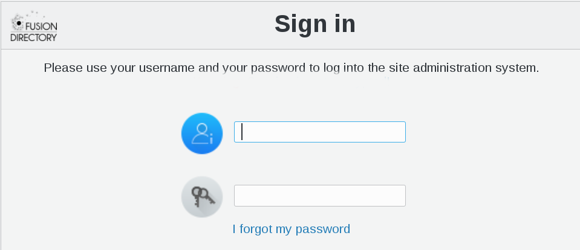

.. include:: /globals.rst

Configure Password recovery
===========================

 FusionDirectory has a password recovery fonction.

    * If the Mail plugin is installed it can use the mail attribute
    * If the Personal plugin is installed it can use the fdPrivateMail
    * If the Supann plugin is installed it can use the supannMailPerso

In the login window of the user's connection, you will find the option “I forgot my password”. 

This option allows your users to generate a new password.

If you click on “I forgot my password” now, the following window appears : 

   
To activate the recovery of the password, the administrator must set it up

* Configuration

Connect as administrator and click on Configuration button in FusionDirectory

.. image:: images/passwordRecovery-configuration.png
   :alt: Picture of Configuration icon in FusionDirectory

Go to Password recovery tab

In the next windows click on “Edit” button bottom right

   
To activate password recovery you must check the box next to “Activate password recovery”    

* Sender email address : e-mail address from which e-mails will be sent (required)
* Link validity (minutes) : number of minutes before a recovery link expires (required)
* Salt for tokens : just a security measure, you can put anything in there, even random characters (required)
* Allow the use of alternate addresses : if checked, users will also be able to enter one of theirs alternate addresses to recover their password

Fill-in First email settings

* Subject : subject of the first e-mail (required)
* Body (first %s is login, second is link) : body of the first e-mail, sent when the users asks for a new password. Use % for the login and the recovery link (required)

Fill-in Second email settings

* Subject : subject of the second e-mail (required)
* Body (%s is login) : body of the first e-mail, sent to confirm that the password has been changed. Use % for the user login (required)

* Use it

Now your users can be able to use password recovery. When they will click on “I forgot my password” this windows will appear

They will enter their full e-mail address and after click on “Change”

A message will appear on the screen informing your user of sending an e-mail to his address, with a link to change his password.

Your user will receive a mail like this : 

.. code-block:: bash

   [FusionDirectory] Password recovery link
 From: reset@fusiondirectory.org
 To: myname@acme.org
 Hello,
 Here are your informations : 
 - Login : myname
 - Link : http://fusiondirectory.org/fusiondirectory/recovery.php?uniq=KSDnZ31AYR7psZETCtHNGyNkzMKfZKOXP9xpTAF5nprwwMnwF3ZH28EL9&uid=tototot&address_mail=myname@acme.org
 This link is only valid for 10 minutes.

When user will browse to the link sending him by e-mail, a message like this will appear on the screen

Now the user need to fill the required new password and then click on “Change”. A confirmation email is sent to his mailbox : 

.. code-block:: bash

 [FusionDirectory] Password Changed recovery successful
 From: reset@fusiondirectory.org
 To: myname@acme.org
 
 Hello,
 Your password has been changed.
 Your login is still myname.
 
 
He just needs to click on “Return to login screen” to connect with his new password
