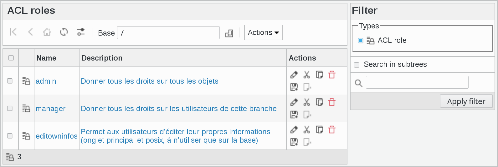
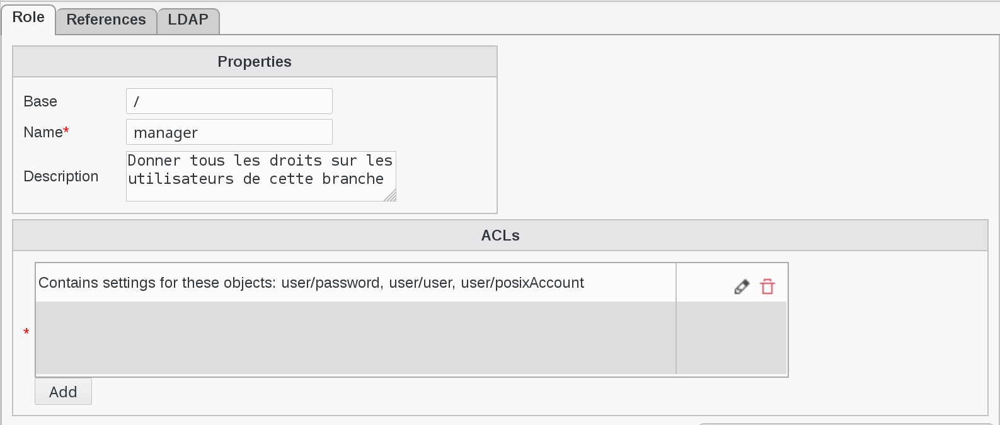
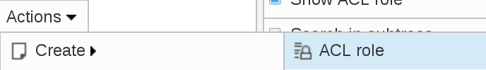

ACL Roles
---------

This page allows to manage ACL Roles

Click on ACL roles icon on FusionDirectory main page

   
You will be directed to ACL roles management page, where you can see the list of all created ACL roles

   

.. note::

   ACL roles can be used to give rights to users through ACL assignment.
   Setup offers to create a few default roles for you with common usecases.
   

If you click on one ACL role, you will see the rights of this role 

The following actions are available:

**Create ACL role**: Create a new ACL role

**Edit**: Edit an existing ACL role

**Remove**: Delete an existing ACL role

.. image:: images/core-action-remove.png
   :alt: Picture of remove ACL role menu in FusionDirectory

**Export list**

   - PDF: Export the current object list as a PDF document
   - CSV: Export the current object list as a CSV file

.. image:: images/core-action-export.png
   :alt: Picture of export menu in FusionDirectory
      
**Copy**: Copy ACL role

.. image:: images/core-action-copy.png
   :alt: Picture of copy menu in FusionDirectory
   
**Cut**: Cut ACL roles to move them

.. image:: images/core-action-cut.png
   :alt: Picture of cut menu in FusionDirectory
   
**Paste**: Paste copied or cut ACL roles to the current base

   
**Restore snapshots**: Restore snapshots of ACL roles

.. image:: images/core-action-restore-snapshots.png
   :alt: Picture of restore snapshots menu in FusionDirectory   
   
