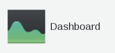
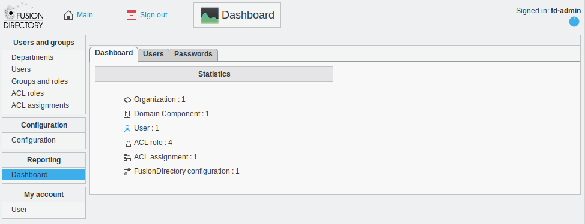
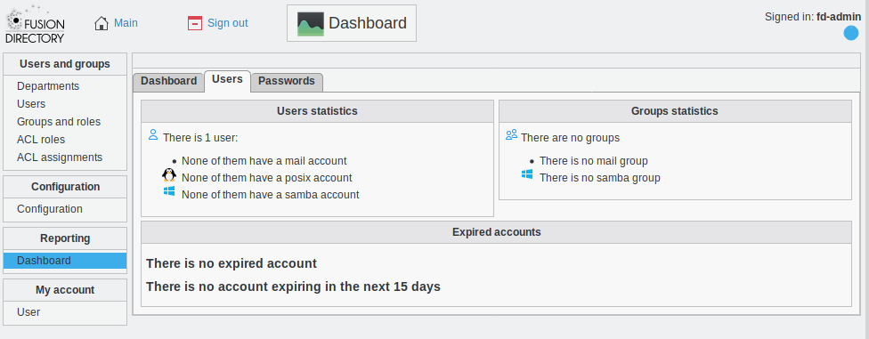
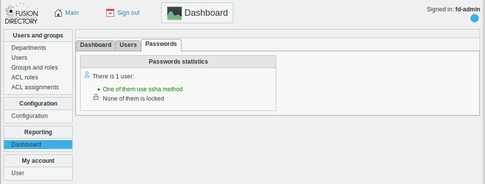

Dashboard
---------

Click on Dashboard icon on FusionDirectory main page

The dashboard screen allows you to consult statistics about the content of your LDAP tree.

The first tab shows the number of objects for each type known to your FusionDirectory installation.
Clicking them will lead you the management page for them, if any.

Users
^^^^^

User tab shows more detailed statistics about users.

It is especially useful to track expired on soon-to-expire users, when using posix plugin.

   
* **Users statistics** : it shows you the number of users and the e-mail account type of each user
* **Groups statistics** : it shows you how many groups there are
* **Expired accounts** : It shows you the expired accounts and the accounts that will expire soon  

Passwords
^^^^^^^^^

Passwords tab shows statistics about passwords, and it is especially useful for tracking old accounts still using an obsolete password method in order to update them.

