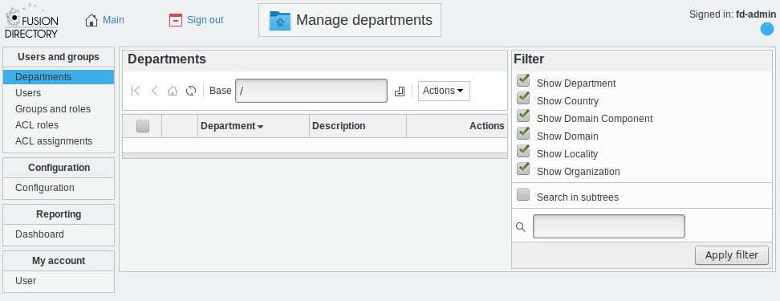

Departments
-----------

This page allows you to manage your LDAP tree structure, so that you may sort the other objects in branches later.

You can create:

* **Department**: Think of this as the LDAP equivalent of a folder, it’s the basic container for organizing objects in your LDAP.
* **Country**: You may use this if your activity is spread over several countries and you want to reflect that in your tree.
* **Domain Component**: You may use that to reflect your DNS in your tree
* **Domain**: Same as above but if you want to put the whole domain as only one node (ie *d=example.com* instead of *dc=example,dc=com*)
* **Locality**: You may use this if your activity is spread over several locations and you want to reflect that in your tree.
* **Organization**: May represent a company or any other kind of organization.