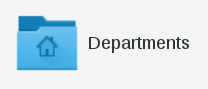
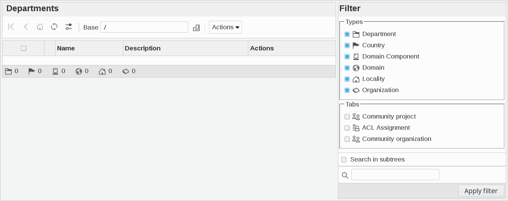
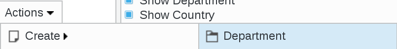
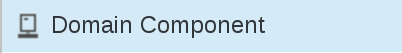
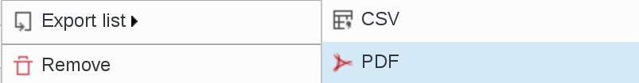

Departments
-----------

This page allows you to manage your LDAP tree structure, so that you may sort the other objects in branches later.

Click on Departments icon on FusionDirectory main page

Your will be directed to Departments management page

The following actions are available:

* **Create Department**: Think of this as the LDAP equivalent of a folder, it’s the basic container for organizing objects in your LDAP.

* **Create Country**: You may use this if your activity is spread over several countries and you want to reflect that in your tree.

* **Domain Component**: You may use that to reflect your DNS in your tree

* **Domain**: Same as above but if you want to put the whole domain as only one node (ie *d=example.com* instead of *dc=example,dc=com*)

* **Locality**: You may use this if your activity is spread over several locations and you want to reflect that in your tree.

* **Organization**: May represent a company or any other kind of organization.

   
* **Export list**: 

   - PDF: Export the current object list as a PDF document
   - CSV: Export the current object list as a CSV file

**Remove**: Delete an existing department

.. image:: images/core-action-remove.png
   :alt: Picture of remove department menu in FusionDirectory
   

   
