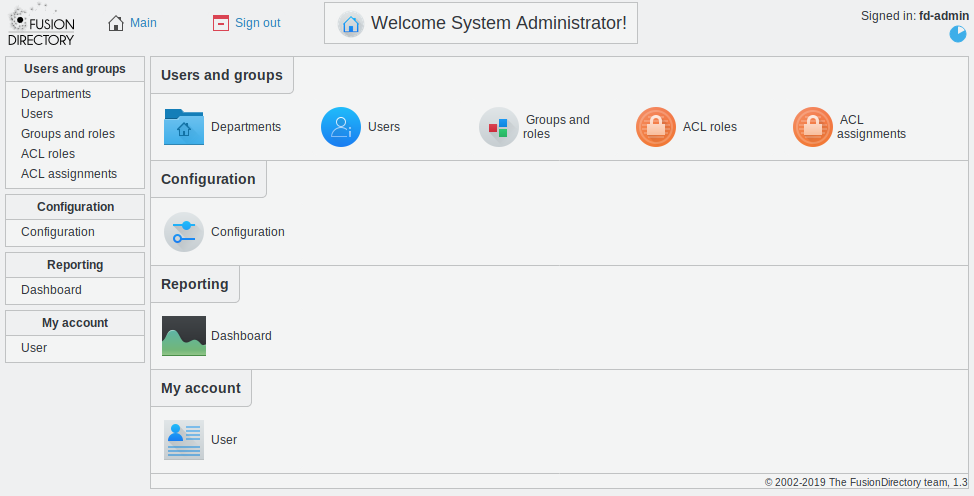

Main menu
---------

Once logged in into FusionDirectory, you get to the main menu. Here is what it looks like with only core installed:

Users and groups
^^^^^^^^^^^^^^^^

This section contains most plugins allowing to manage objects in your LDAP, by default mainly users and groups as the name suggest, but as you install plugin you may end up handling other types of objects.

Configuration
^^^^^^^^^^^^^

This section contains the configuration page of your FusionDirectory installation, and it may contain configuration screen for other plugins as you install them.

Reporting
^^^^^^^^^

This section contains the dashboard and any reporting plugin you may install.

My account
^^^^^^^^^^

This special category shows you the user tabs for the user account you signed in as. It’s in this section that your users will be able to edit their own informations if you give them ACL rights to do so.