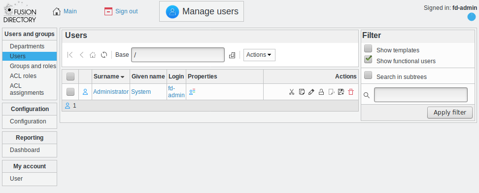

Users
-----

This page is for user management.

All management pages you will see in FusionDirectory will look like this.
This one allows to manage users.

Navigation
^^^^^^^^^^

The navigation bar allows you to navigate your tree. The first icon will take you to your LDAP root, the second one will move one branch up, the third one goes to the LDAP base the user you are signed in as is stored.
Then there is a refresh button, and then the Base dropdown allows you to quickly jump anywhere in your tree.

Actions
^^^^^^^

The following actions are available:

* Create
   - User: Create a new user
   - From template: Create a new user from a template
   - Template: Create a user template
* Edit: Edit an existing user
* Remove: Delete an existing user
* Lock users: Lock existing users
* Unlock users: Unlock existing users
* Apply template: Apply a template to an existing user
* Export list
   - PDF: Export the current object list as a PDF document
   - CSV: Export the current object list as a CSV file
* Copy: Copy users
* Cut: Cut users to move them
* Paste: Paste copied or cut users to the current base
* Restore snapshots: Restore snapshots of users

Filter
^^^^^^

The filter box on the right lets you filter what you are listing.
You can select which object types you want to list or hide, if you want to show templates or hide them.
You can also filter objects depending on which tabs are activated on them.

You can also you the text box to do a text search.

Checking the "Search in subtrees" checkbox allows to search in the whole subtree under the current base.

List
^^^^

In the list you see objects matching current filter options under the currently selected base.
You can click on column headers to sort the list and you can quickly access actions on an object using the icons in the last column.
You may also check several objects in the first column and apply an action to all of them using the actions menu.

Under the list is a summary of how many objects of each type are shown.