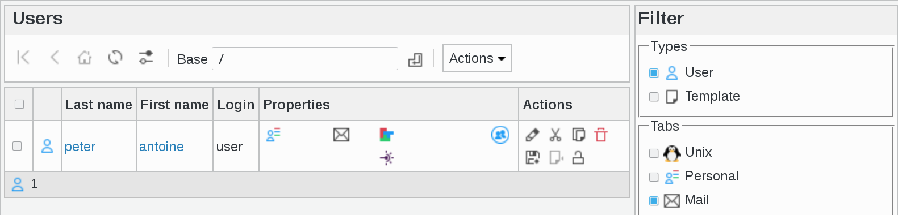

Users
-----

This page is for user management.

You can access Users management in two ways : either by clicking Users icon on FusionDirectory main page 

   
or by clicking Users entry in Users and Groups Menu on the left   
   

You will be directed on users management page
   

   

.. note::

   All management pages you will see in FusionDirectory look like this.
   This one allows to manage users. 

     

Click on one user entry in order to access this user's information overview  
   

   
FusionDirectory is based on tabs. You will find the same tab-system in plugins, configuration etc. 

Activated tabs are always in black and non-activated tab are gray. 
   

Navigation
^^^^^^^^^^

The navigation bar allows you to navigate your tree. The first icon will take you to your LDAP root, the second one will move one branch up, the third one goes to the LDAP base the user you are signed in as is stored.
Then there is a refresh button, and then the Base dropdown allows you to quickly jump anywhere in your tree.

Actions
^^^^^^^

The following actions are available:

**Create User**: Create a new user

**Create From template**: Create a new user from a template

   
**Create Template**: Create a user template

**Edit**: Edit an existing user

.. image:: images/core-action-edit.png
   :alt: Picture of edit user menu in FusionDirectory

**Remove**: Delete an existing user

**Lock users**: Lock existing users

**Unlock users**: Unlock existing users

**Apply template**: Apply a template to an existing user

**Export list**

   - PDF: Export the current object list as a PDF document
   - CSV: Export the current object list as a CSV file

.. image:: images/core-action-export.png
   :alt: Picture of export menu in FusionDirectory
      
**Copy**: Copy users

   
**Cut**: Cut users to move them

   
**Paste**: Paste copied or cut users to the current base

.. image:: images/core-action-paste.png
   :alt: Picture of paste menu in FusionDirectory
   
**Restore snapshots**: Restore snapshots of users

.. image:: images/core-action-restore-snapshots.png
   :alt: Picture of restore snapshots menu in FusionDirectory
   
Filter
^^^^^^

On the right, you have a very practical Filter menu. The filter box let you filter what you are listing.

You can select which object types you want to list or hide, if you want to show templates or hide them.

You can also filter objects depending on which tabs are activated on them.

You can also you the text box to do a text search.
   
.. image:: images/core-filters.png
   :alt: Picture of filters overview in FusionDirectory
   
Click on the filter you are interested in in order to show all the users that apply to that filter. 

For example, if you select "Mail" filter, you will see the list of users having Mail plugin installed
   

         
Checking the "Search in subtrees" checkbox allows to search in the whole subtree under the current base.
   

   
There is an option to search on attribute dependent on the columns displayed in the filter.

When you put your cursor on the magnifying glass icon under filter menu, a black line will appear, describing the different items displayed for this user

.. image:: images/core-filters-magnifying-glass-icon.png
   :alt: Picture of magnifying glass icon in FusionDirectory   
   
List
^^^^

In the list you see objects matching current filter options under the currently selected base.

In this example, we selected the following filter : Mail
   

You can click on column headers to sort the list 
   
.. image:: images/core-column-headers.png
   :alt: Picture of column headers in FusionDirectory
   
and you can quickly access actions on an object using the icons in the last column
   

   
You may also check several objects in the first column and apply an action to all of them using the actions menu.

Under the list is a summary of how many objects of each type are shown (in this example there is 1 Department and 3 Users
   

   

.. note::

   In FusionDirectory you can show **each icon description** by simply putting the cursor on the concerned icon
   
   
For example, the "floppy disk" icon means "Create a new snapshot from this object"   
   

