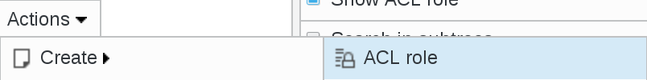
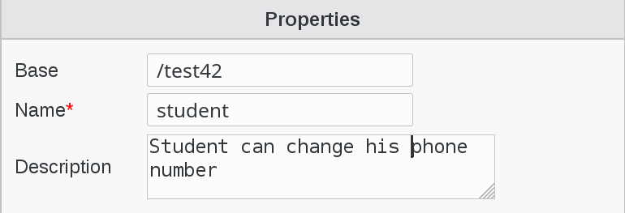
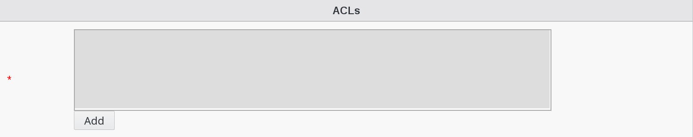
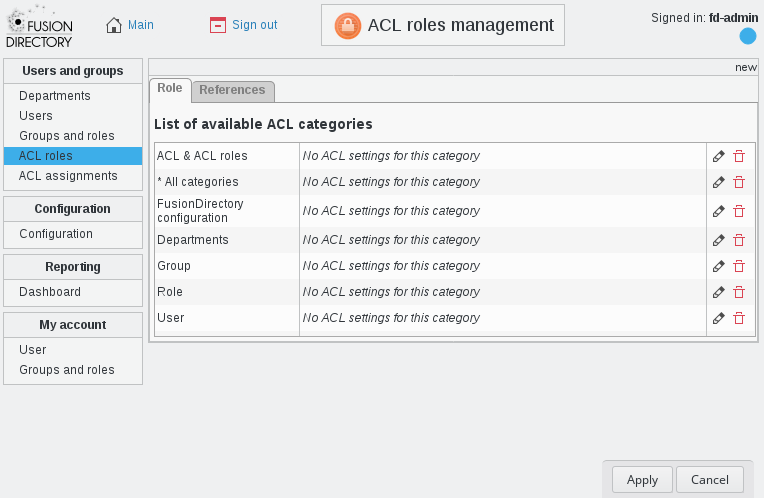
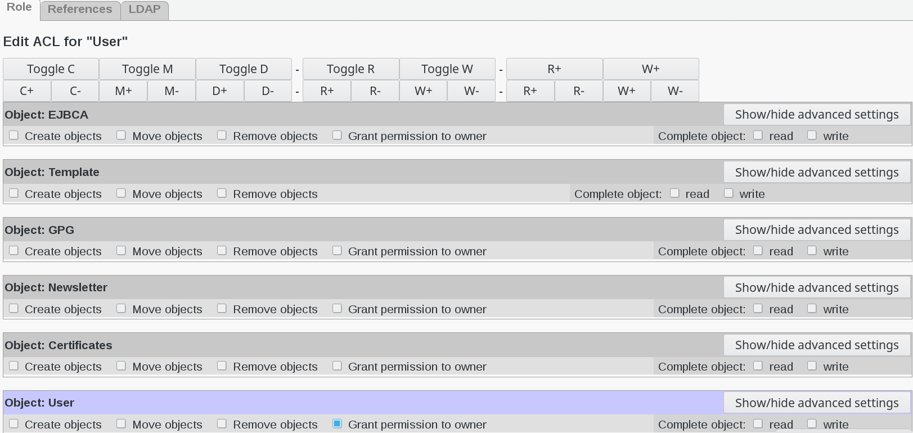
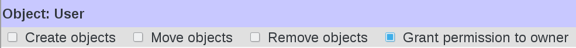
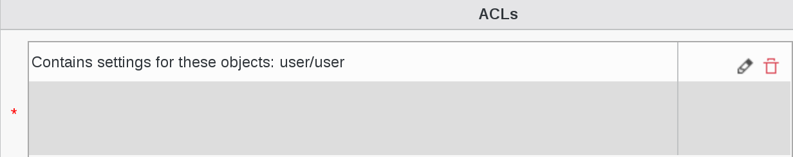

.. include:: /globals.rst

Create ACLs
===========

* How to create an ACL role

To give rights to users, the first step is to define an ACL role which will list the permissions you want to give.

Now let’s get more into the details of which kind of permission an ACL role can give.

Click on ACL roles icon on FusionDirectory main page

Click on Actions --> Create --> ACL role

Fill name and description as you see fit.\\

Click **Add** button bottom left ACLs

You will see a screen listing the ACL categories:

Click on pencil icon next to User category

Then you have a part for each user tab depending on your installed plugins. The **Create** right on a tab allows to activate it while the **Remove** one allows to deactivate.

The **Grant permission to owner** checkbox allows to give rights only on the user’s own node as in the editowninfos role we used earlier.

In this case we want to create a role named student having the rights to read and write his phone number.

   
Check the box against Grant permission to owner

   
Go to object User and click on Show/hide advanced settings button   

   
Check read and write options in Business mobilenumber  

Click on Apply button

   
Now, on the List of available ACL categories you can see that User category changed to ACL for these objects: user   

     
Click on Apply button

   
Now you can see that ACL's settings are filled-in

Click on Ok button bottom right   

