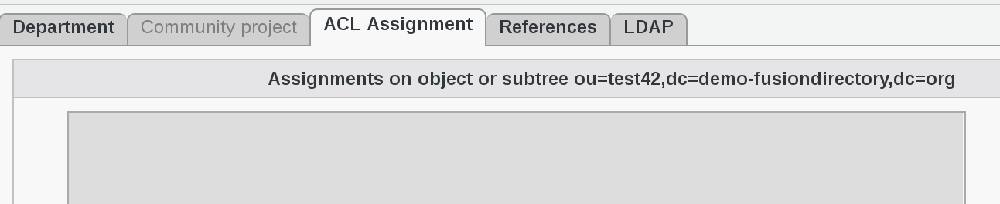
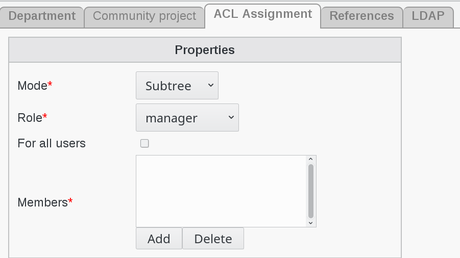
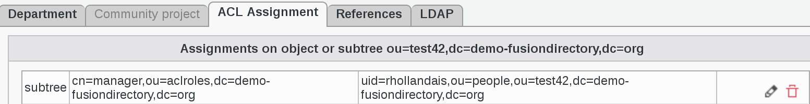
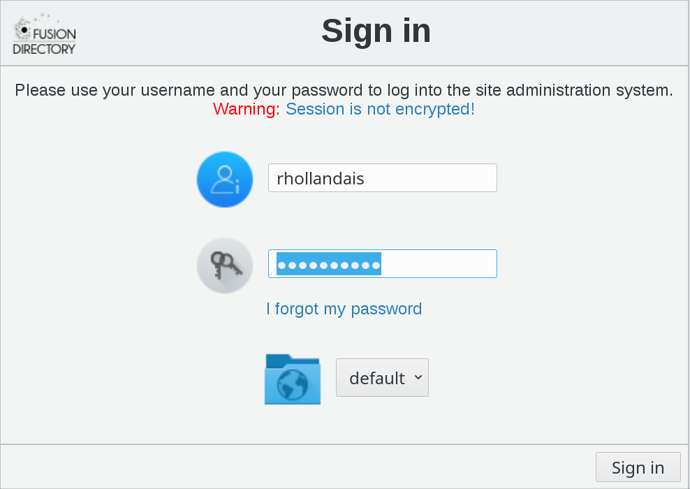
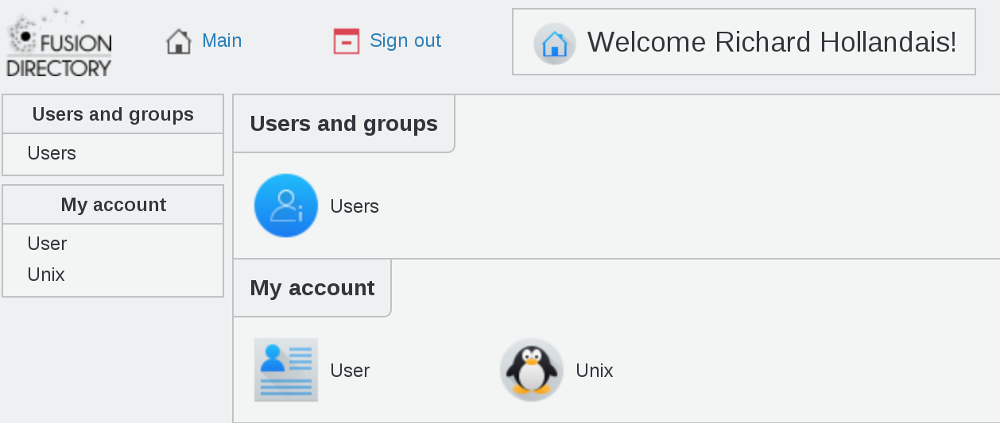
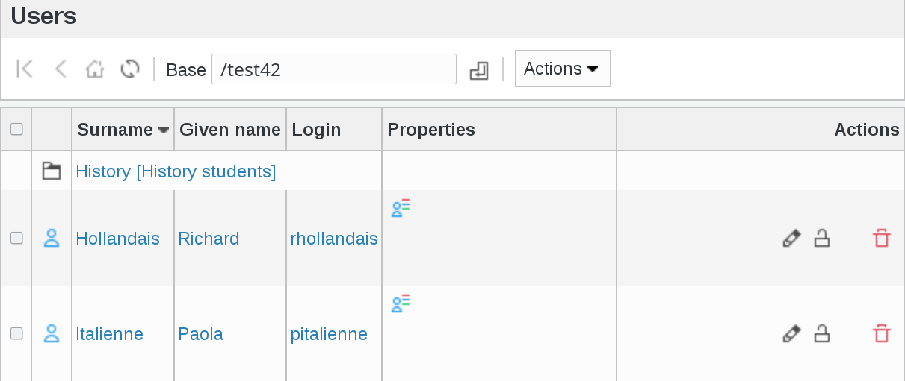

.. include:: /globals.rst

Use ACLs with department
========================

delegate department management
------------------------------

  
So, let’s say you want to give manager rights to user **Richard Hollandais** to the branch **ou=test42,dc=demo-fusiondirectory,dc=org** 

Start by clicking on Departments icon on FusionDirectory main page

Then click on edit icon (pencil) against test42 department line 

Go to ACL Assignment tab.

Click on Add button bottom left

.. image:: images/acl-add-button.png
   :alt: Picture of Add button in FusionDirectory
   
Fill-in ACL Assignment tab settings

* **Mode** : subtree
* **Role** : manager
* **Members** : rhollandais

In order to select members, click on add button against member

.. image:: images/acl-add-button.png
   :alt: Picture of Add button in FusionDirectory
   
Select user Richard Hollandais from the users list   

Click on Add button bottom right

.. image:: images/acl-add-button.png
   :alt: Picture of Add button in FusionDirectory 
   
Click again on Add button bottom right

You can now see the ACL Assignment tab filled with role manager for user Richard Hollandais

   
Click on Ok button bottom right  

.. image:: images/acl-ok.png
   :alt: Picture of Ok button in FusionDirectory    

Result
------

Now in order to see that Manager Richard Hollandais can manage student Paola Italienne, let's sign in FusionDirectory as rhollandais

As manager role, he can see Users icon on his interface

   
Click on Users icon and you will see the users Richard can manage   

