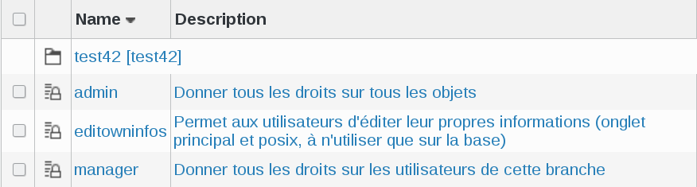
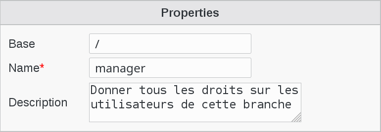
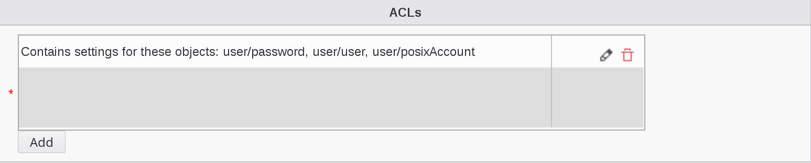
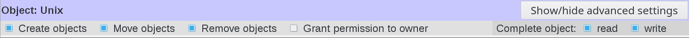
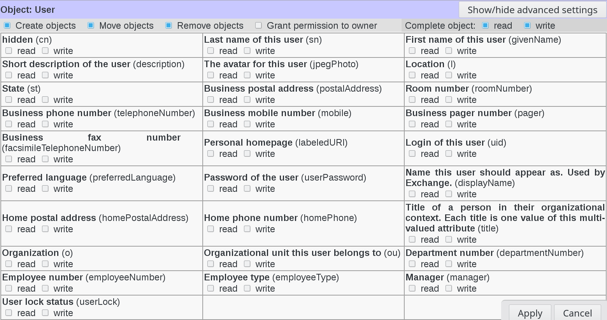
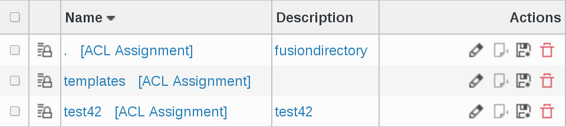
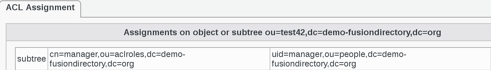

.. include:: /globals.rst

Functionalities
===============

ACL roles
---------

* What can a person do in FusionDirectory?

Click on ACL roles icon on the main page of FusionDirectory

.. image:: images/acl-acl-roles-icon.png
   :alt: Picture of ACL Roles icon in FusionDirectory

The ACL role groups all the rights you want to give to a group or a user 

You will see the list of created roles. 

Each role has two columns :

* **Name** : this is the name of the role
* **Description** : a short description of what can be done by this role

   
Click on a role, in this example manager; you will be on Role tab

Properties settings

   
* **Base** : object base

If you put the cursor on the base field, you will see all the base objects and you will be able to choose the one that you need.

* **Name** : a name for this role (required)
* **Description** : short description of this role 

ACLs settings

This field is very important because it defines the settings of the rights that this role has and the objects that it can manage

   
In order to see the list of ACL categories assigned to this role, click on the little pencil on the right

.. image:: images/acl-pencil.png
   :alt: Picture of pencil icon in FusionDirectory
   
This will bring you to the whole list of available ACL categories. Scroll down to see the categories assigned to this role.

In this example, User is assigned to this role and it is marked as "ACL for these objects: posixAccount, user".

   
Click on the little pencil next to User category on the right

.. image:: images/acl-pencil.png
   :alt: Picture of pencil icon in FusionDirectory  
   
This will give you a simplified view of Object User attributes, highlighted in purple

   
The **beauty** and the **strength** of FusionDirectory is that you can also play on each single attribute of the object. 

To do this, click on "Show/hide advances settings" button on next to the object you are interested in

.. image:: images/acl-show-hide-button.png
   :alt: Picture of Show/hide advances settings button in FusionDirectory
   
This wil open a dialog incliding all the object settings and you can check/uncheck the ones you need

   
Then you have a part for each user tab depending on your installed plugins. 
The **Create** right on a tab allows to activate it while the **Remove** one allows to deactivate.\ 
The **Grant permission** to owner checkbox allows to give rights only on the user’s own node as in the editowninfos role we used earlier. 

.. note::

  In FusionDirectory when you give write access to an attribute or whole object this also imply that you have read access on those attributes or objects

Special cases about rights
__________________________

Template
........

The template part is available for objects which support templates and allow to give rights on templates, and control rights on the template_cn field.

To be able to create a user using a template, the connected user needs:

* Read right of user/template:template_cn on the template object (or any parent department)

* Create right of user/user on the base the user is created in (or any parent department)

* Write right of the fields required by the templates on the base the user is created in (or any parent department)

Snapshot
........

There is a Snapshot part for objects which supports snapshots.

* Create right means the user will be able to take new snapshots

* Delete right means he will be able to delete existing snapshots

* Write right on restore_over field means he will be able to restore snapshots of an existing object

* Write right on restore_deleted field means he will be able to restore snapshots of deleted objects  

ACL assignments
---------------

* How to assign ACLs

After the creation of a role, we can say what a person has the right to do.

Click on ACL Assignments icon in FusionDirectory

You will see the list of ACL Assignments

   
Click on an ACL Assignment, in thie example test42 and you will see three columns

   

* **first column** : on what mode of operation the LDAP will work 
* **second column** : the dn of the role. It defines the rights assigned to the person in column 3 in relation to the ACLs assigned to him 
* **third column** : person to which the ACL is assigned

ACL filter
----------

We have 2 kind of filters:

* Restrict users with filter
* Restrict targets with filter

Restrict users with filter
__________________________

Restrict users with filter can be used to restrict members to the one matching this filter.

* This is a **fixed filter** with no support for template matching.
* Example: (eduPersonAffiliation=student) to limit to users with student supann affiliation. This may be used when «all users» is checked, or when the members contain groups in which there are students and non-students.

Restrict targets with filter
____________________________

Restrict targets with filter can be used to restrict target objects on which rights are given.

* This is a **template pattern** which may use any user field.
* Example: (manager=%dn%) on base with subtree, will only give rights on objects of which we are manager. It may be smarter to put add an objectClass check in the filter. An other example is (memberUid=%uid%) to give rights on groups the user is member of.

For target filter, people should avoid using a field that users can edit in the filter like (something=%description%) if users are allowed to edit their description.

Also, target filter should not match more than the sizelimit, so it should not be used for something too general like (eduPersonAffiliation=student), because that will match a lot of LDAP node and FD will attempt at tstoring an ACL for each of them in RAM. (user filter have no such restriction because they are only tested on the logged in user).
