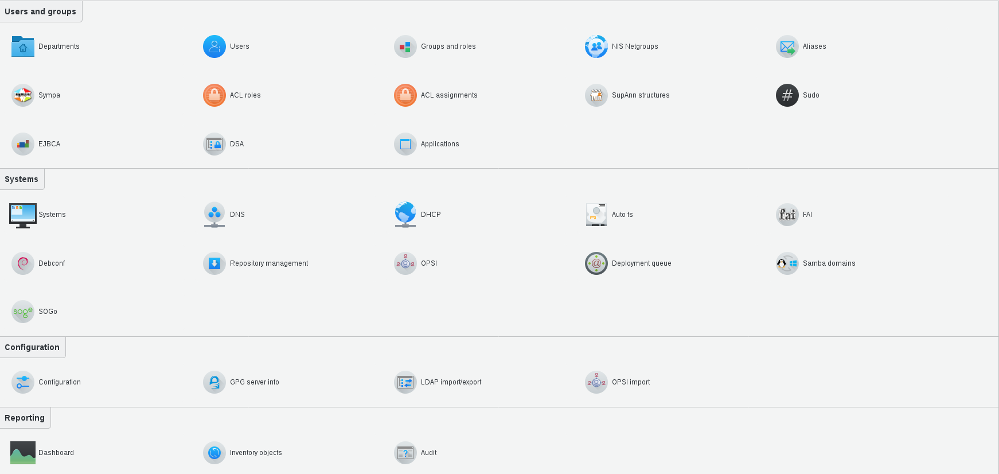
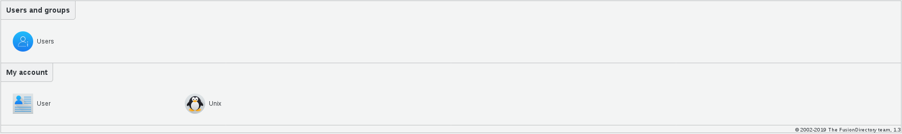

Introductions
-------------

FusionDirectory ACLs can be used to give rights on FusionDirectory content to other users than the admin.
They can be used to allow users to edit their own information for instance, or to allow a project manager to edit the users from his team.

For example, here is the Admin view of the interface. As you can see, the Admin has access to all the plugins

   
And here is the Manager view. As you can see, the Manager can only access Users and groups, account and Unix

