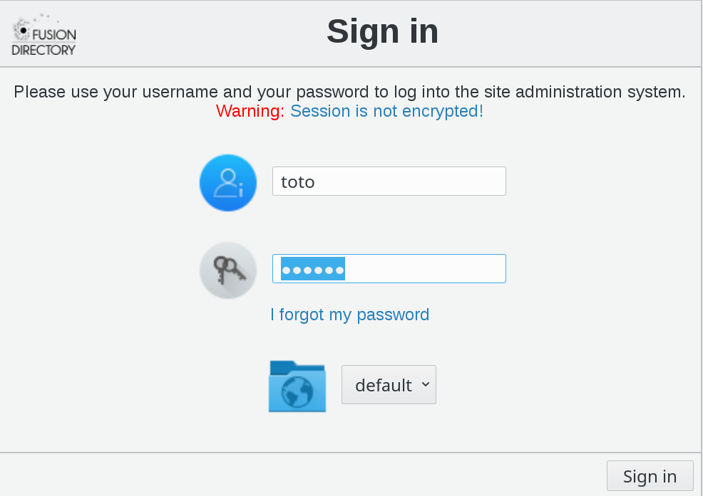

.. include:: /globals.rst

ACLs Assignment with user filter
================================

ACLs Assignment
---------------

Click on ACL assignments on FusionDirectory main page

.. image:: images/acl-assignments-icon.png
   :alt: Picture of ACL Assignments icon in FusionDirectorys
   
Click on the ACL assignment that you need

   
ACL Assignment tab you can see all the assignments

.. image:: images/acl-assignements-tab-list0.png
   :alt: Picture of ACL Assignment tab in FusionDirectory
   
Click on Add button bottom left   

.. image:: images/acl-add-button.png
   :alt: Picture of Add button in FusionDirectory
   
Select ACL Assignment properties as follows 

* **Mode** : subtree
* **Role** : student
* **All users** : ticked

Add your member filter as follows

* **Member filter**: (uid=toto)

Click on Add button bottom right   

.. image:: images/acl-add-button.png
   :alt: Picture of Add button in FusionDirectory
   
You can see that ACL Assignment tab is now correctly filled

   
Click on Ok button bottom right to save   

.. image:: images/acl-ok.png
   :alt: Picture of Ok button in FusionDirectory

Result
------
   
* User view

Now let's see how the ACL has been applied to our User

Login as toto

   
Click on User icon

.. image:: images/acl-user-icon.png
   :alt: Picture of user icon in FusionDirectory
   
We only have our mobile info because we assign ACL Role student for everyone but it applied only for (uid=toto)

ACLs Assignment with target filter
==================================

ACLs Assignment
---------------

Click on ACL assignments on FusionDirectory main page

.. image:: images/acl-assignments-icon.png
   :alt: Picture of ACL Assignments icon in FusionDirectorys
   
Click on the ACL assignment that you need

   
ACL Assignment tab you can see all the assignments

.. image:: images/acl-assignements-tab-list0.png
   :alt: Picture of ACL Assignment tab in FusionDirectory
   
Click on Add button bottom left   

.. image:: images/acl-add-button.png
   :alt: Picture of Add button in FusionDirectory
   
Select ACL Assignment properties as follows 

* **Mode** : subtree
* **Role** : manager
* **Members** : toto

Add your target filter as follows

* **Member filter**: (manager=%dn%)

Click on Add button bottom right   

.. image:: images/acl-add-button.png
   :alt: Picture of Add button in FusionDirectory
   
You can see that ACL Assignment tab is now correctly filled

   
Click on Ok button bottom right to save   

.. image:: images/acl-ok.png
   :alt: Picture of Ok button in FusionDirectory

Result
------
   
* User view

Now let's see how the ACL has been applied to our User

Login as toto

   
Click on User icon to manage them

   
We see that we can manage another user because the target filter give the manager right for the objects where (manager=%dn%) match (%dn% mean our own dn)

