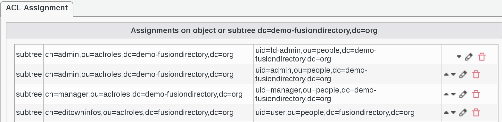
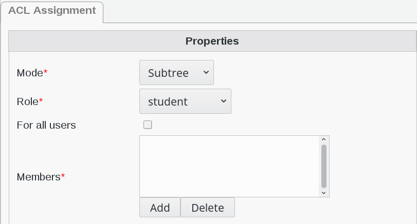
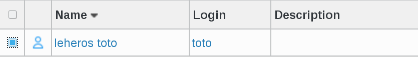
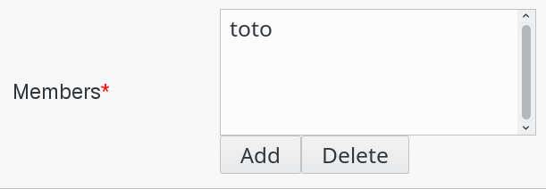
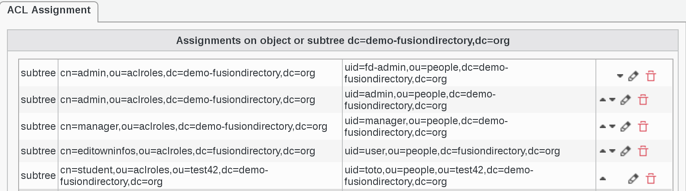
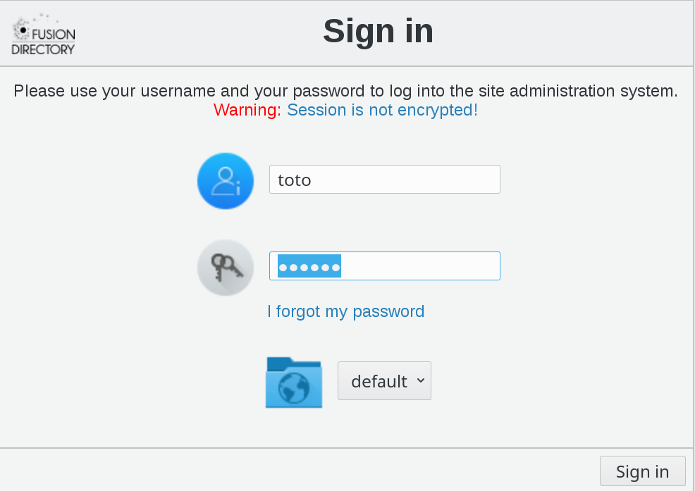
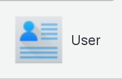
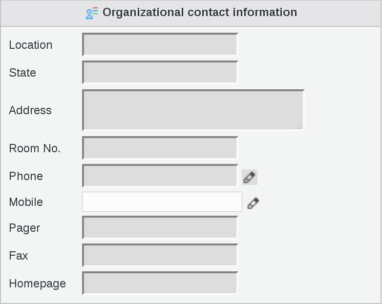

.. include:: /globals.rst

Use ACLs
========

ACLs Assignment
---------------

Click on ACL assignments on FusionDirectory main page

   
Click on the ACL assignment that you need

   
ACL Assignment tab you can see all the assignments

   
Click on Add button bottom left   

   
Select ACL Assignment properties as follows 

* **Mode** : subtree
* **Role** : student

   
Select a user by clicking on Add button under Members field
   
Select the user to whom you wish to assign student role (in this example, leheros toto)      

Click on Add button bottom right   

   
In ACL Assignment tab you can now see toto in Members field     

Click on Add button bottom right   

   
You can see that ACL Assignment tab is now correctly filled

   
Click on Ok button bottom right to save   

.. image:: images/acl-ok.png
   :alt: Picture of Ok button in FusionDirectory

Result
------
   
* User view

Now let's see how the ACL has been applied to our User

Login as toto

   
Click on User icon

   
Click on Edit button bottom right   

   
You will see that the only editable field is Mobile (this user can only modify his mobile number as per the ACL that we set earlier)

