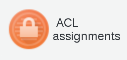
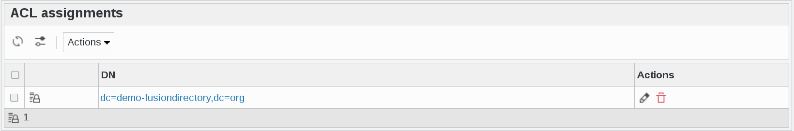
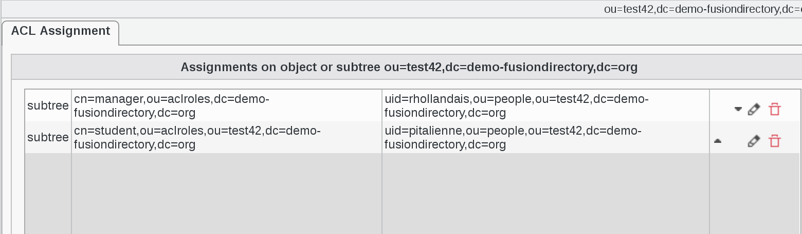
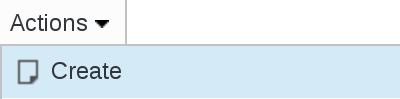

ACL Assignments
---------------

Click on ACL assignments icon on FusionDirectory main page

This page allows to assign ACL roles to user and manage existing assignments.

   

.. note::

   Note that only existing assignments are shown here, if you want to add ACL assignment on a department which has none yet, you need to go in **Departments**, edit this object and go to the ACL tab.

Click on an ACL assignments to see its assignments

The following actions are available:

**Create ACL assignment**: Create a new ACL assignment

**Edit**: Edit an existing ACL assignment

.. image:: images/core-action-edit.png
   :alt: Picture of edit ACL assignment menu in FusionDirectory

**Remove**: Delete an existing ACL assignment

.. image:: images/core-action-remove.png
   :alt: Picture of remove ACL assignment menu in FusionDirectory

**Export list**

   - PDF: Export the current object list as a PDF document
   - CSV: Export the current object list as a CSV file

.. image:: images/core-action-export.png
   :alt: Picture of export menu in FusionDirectory
   
**Restore snapshots**: Restore snapshots of ACL assignments

.. image:: images/core-action-restore-snapshots.png
   :alt: Picture of restore snapshots menu in FusionDirectory      
