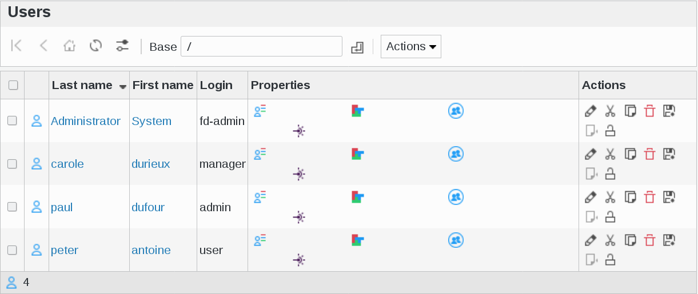
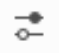
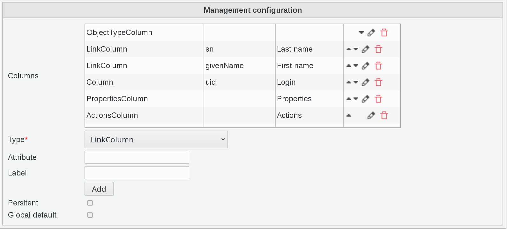
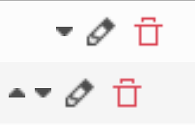
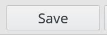
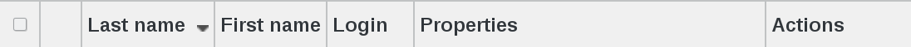

Configurable lists
------------------

Unlike version 1.3, where you had to see the list as it is, in the latest version of FusionDirectory you can decide what you want to see.

Click on Users icon on FusionDirectory main page

You will be directed to Users page

On top left page you will see a little icon representing two lines with a dot 
   

By clicking on this icon, you can decide which items you want to see in the list

   
You can play with the little arrows to determine the order of the items in the list.  

   
On configuration page, fill in the following fields :

* **Type** : type of column (required)
* **Attribute** : LDAP attributes to display, separated by commas. The special values "nameAttr" and "mainAttr" also work   
* **Label** : title of the column
* **Persistent** : Should this configuration be saved in LDAP as the default configuration for this page
* **Global default** : Should this configuration be saved in LDAP as the default configuration for this page for all users

Click on save button, bottom right 

Now, on Users main page you will see columns in the order you choose

