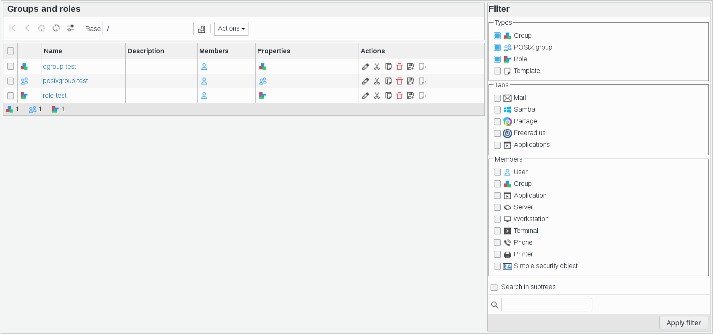
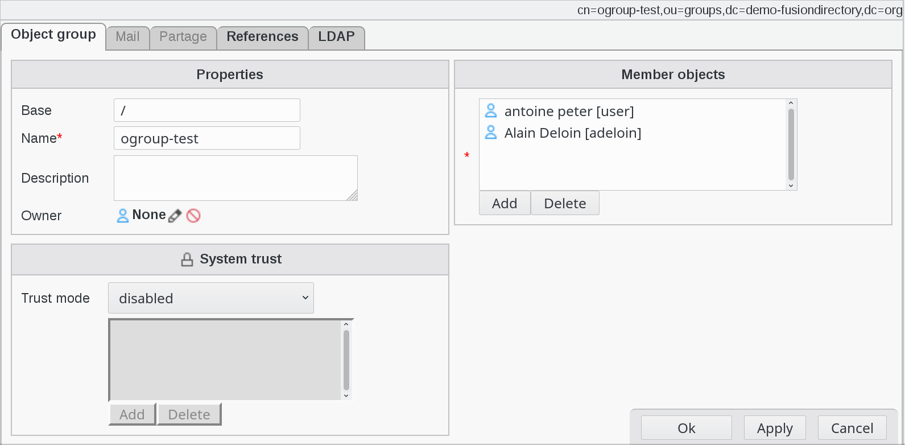
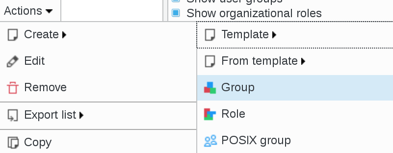
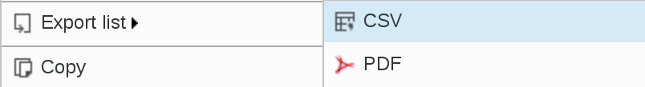

Groups
------

This page is for groups and roles management.

.. warning::

   In big groups, you can encounter a PHP fatal error. When it happened you can adapt your PHP configuration with the next value "pcre.backtrack_limit=10000000"

Click on Groups and roles icon on FusionDirectory main page

You will be directed to Groups and roles management page

Click on one group entry in order to access this group's information overview  
   

On the previous page, the following actions are available:

**Create Template Group**: Create a group template

.. image:: images/core-create-template-group.png
   :alt: Picture of create group template menu in FusionDirectory

**Create Template Role**: Create a role template

   
**Create POSIX Group**: Create a POSIX group template

**Create From Template Role**: Create a role using a template

**Create From Template POSIX Group**: Create a POSIX group using a template

   
Of course, you can also create groups, roles and POSIX groups from scratch, by clicking on Actions--> Create --> Group, Actions--> Create --> Roles, Actions--> Create --> POSIX Groups   

   
**Edit**: Edit an existing group

**Remove**: Delete an existing group

**Export list**

   - PDF: Export the current object list as a PDF document
   - CSV: Export the current object list as a CSV file

      
**Copy**: Copy groups

   
**Cut**: Cut groups to move them

   
**Paste**: Paste copied or cut groups to the current base

   
**Restore snapshots**: Restore snapshots of groups

    
