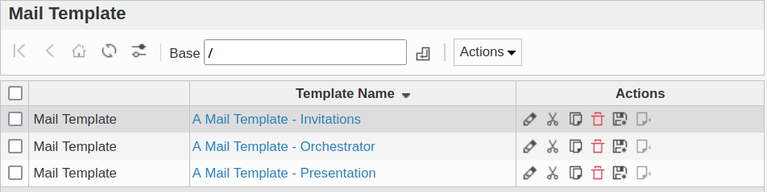
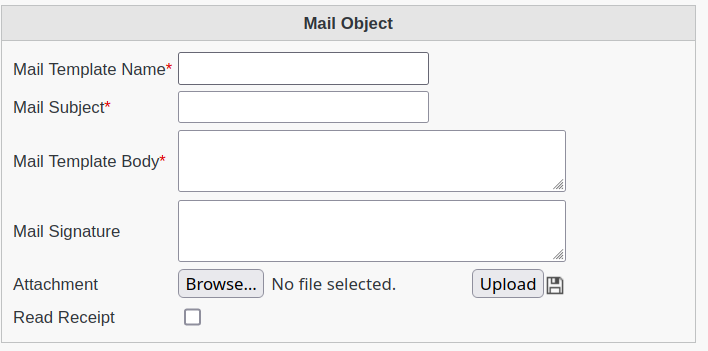

Mail Template
-------------

This page allows to manage Mail Template objects

You can create new e-mail template easily.

The mail template accept in the mail body that you use the following macros :

* %givenName%
* %sn%
* %uid% 

example
=======

if you write in the mail body field 

**Hello %uid% how are you ?**

it will send

**Hello <the uid of the user that will get the mail> how are you ?**
