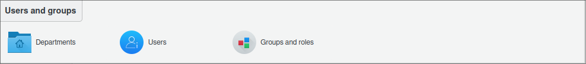
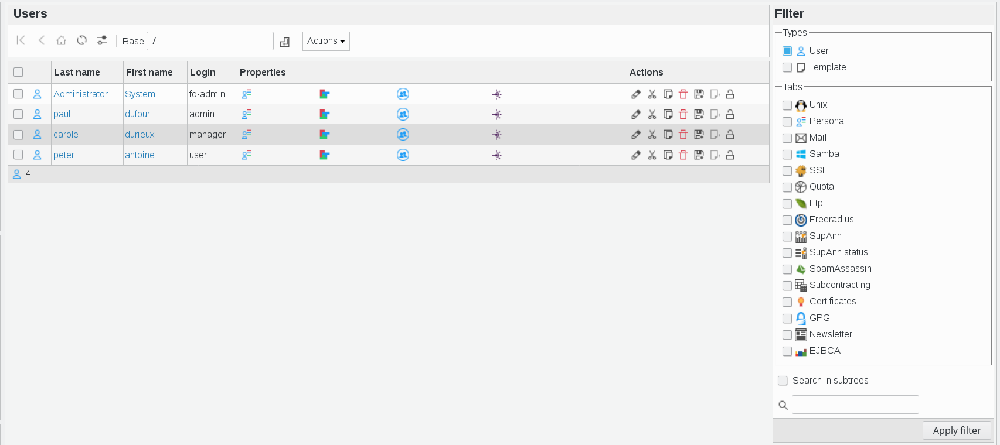
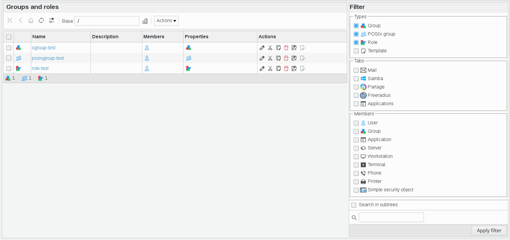

Main Menu
---------
Once logged into FusionDirectory, you are presented with the main menu.

Below is an example of how it appears with the core view:

Users and Groups
^^^^^^^^^^^^^^^^

This section contains most plugins that allow the management of objects in your LDAP directory.
By default, it primarily includes users and groups, as the name suggests.
However, installing additional plugins may enable you to manage other types of objects.

In this example, the user has access to the following *Users and Groups* sections:  

**Departments**  

Manage **departments**, **countries**, **domain components**, **domains**, **localities**, and **organization nodes**.  

Here is an overview of the *Departments* section:  

.. image:: images/core-departments-details.png  
   :alt: Departments section details in FusionDirectory  

**Users**  

Manage user accounts and their associated properties.  

Here is an overview of the *Users* section:  

**Groups and Roles**  

Manage **object groups**, **POSIX groups**, and **roles**.  

Here is an overview of the *Groups and Roles* section:  

Access Control
^^^^^^^^^^^^^^

This section allows the management of **access control settings**. In this example, the user has access to the following *Access Control* sections:  

**ACL Roles**  

Manage **Access Control List (ACL) roles**.  

Here is an overview of the *ACL Roles* section:  

.. image:: images/core-acl-roles-details.png  
   :alt: ACL roles section details in FusionDirectory  

**ACL Assignments**  

Assign **ACL roles to users**.  

Here is an overview of the *ACL Assignments* section:  

.. image:: images/core-acl-assignments-details.png  
   :alt: ACL assignments section details in FusionDirectory  

Workflow
^^^^^^^^^

This section provides options to efficiently configure workflows. Users can customize tasks and set up email templates for automated sending at a later stage.  

**Mail Template**  

Manage email templates assigned to tasks.  

Here is an overview of the *Mail Template* section:  

**Tasks**  

Manage tasks and create multiple sub-tasks.  

Here is an overview of the *Tasks* section:  

Dashboard
^^^^^^^^^^

The *Dashboard* section provides an overview of workflow status and other informative panels.  

**Tasks Dashboard**  

Gain a clear overview of created tasks and their status.  

Here is an overview of the *Tasks Dashboard* section:  

.. image:: images/core-dashboard-taskdashboard.png  
   :alt: Tasks Dashboard section in FusionDirectory  

**Plugins**  

View and manage installed plugins within FusionDirectory.  

Here is an overview of the *Plugins* panel:  

Configuration
^^^^^^^^^^^^^

The *Configuration* section contains settings for FusionDirectory. If additional plugins are installed, their configuration screens may also appear here.  

Here is an overview of the *Configuration* section:  

.. image:: images/core-configuration-details.png  
   :alt: Configuration section details in FusionDirectory  

My Account
^^^^^^^^^^

This special section displays user-specific settings for the currently logged-in account. Users can edit their personal information here, provided they have the necessary ACL permissions.  

Here is an overview of the *My Account* section:  

.. image:: images/core-user-session-details.png  
   :alt: My Account section in FusionDirectory