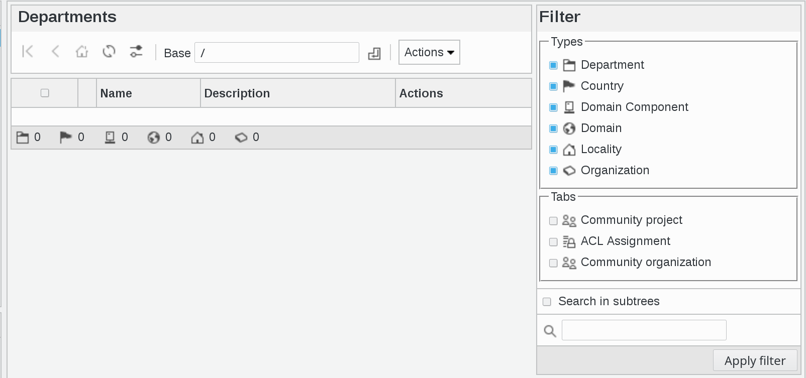
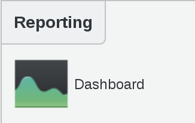

Main menu
---------

Once logged in into FusionDirectory, you get to the main menu. Here is what it looks like with core view:

.. image:: images/menu.png
   :alt: Main menu

Users and groups
^^^^^^^^^^^^^^^^

This section contains most plugins allowing to manage objects in your LDAP, by default mainly users and groups as the name suggest, but as you install plugin you may end up handling other types of objects. 

In our example, this user can access the following Users and groups sections:

.. image:: images/core-users-groups.png
   :alt: Picture of Users and Groups section in FusionDirectory
   
* **Departments** : manage Departments, countries, domain components, domains, localities and organization nodes

Here is an overview of Departments section details

   
* **Users** : manage user accounts and their properties

Here is an overview of Users section details

.. image:: images/core-users-details-section.png
   :alt: Picture of Users section details in FusionDirectory
   
* **Groups and roles** : allows you to manage objects groups, POSIX groups and roles

Here is an overview of Groups and roles section details

.. image:: images/core-groups-and-roles-section-details.png
   :alt: Picture of Groups and roles section details in FusionDirectory
   
* **ACL roles** : manage ACL roles

Here is an overview of ACL roles section details

   
* **ACL assignments** : manage ACL roles assignments to users

Here is an overview of ACL asignments section details

   
Configuration
^^^^^^^^^^^^^

This section contains the configuration page of your FusionDirectory installation, and it may contain configuration screen for other plugins as you install them.

.. image:: images/core-configuration-icon.png
   :alt: Picture of Configuration section in FusionDirectory

Here is an overview of configuration section details 

      

Reporting
^^^^^^^^^

This section contains the dashboard and any reporting plugin you may install.

My account
^^^^^^^^^^

This special category shows you the user tabs for the user account you signed in as. It’s in this section that your users will be able to edit their own informations if you give them ACL rights to do so.

.. image:: images/core-myaccount-user-icon.png
   :alt: Picture of My account section in FusionDirectory

Here is an overview of user section details 

   
