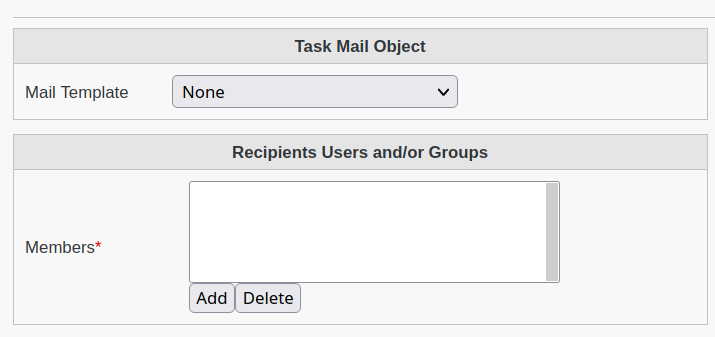
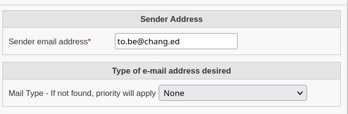

Tasks
-----

This page allows to manage Tasks objects

.. image:: images/core-tasks.png
   :alt: Picture of mail template within FusionDirectory

You can create new Tasks easily.

.. image:: images/core-tasks-creation.png
   :alt: Picture of tasks creation within FusionDirectory

* **Time**: Allows the schedule of the tasks to be timed in Hours:Minutes:Seconds format.

Select the type of tasks available.

.. image:: images/core-tasks-creation-subtasks.png
   :alt: Picture of tasks - subtasks creation within FusionDirectory

* **Acticate Subtasks**: Allows the creation of subtasks which will be processed by FusionDirectory Orchestrator.
  
Choose the options for the mail tasks

* **Mail Template**: Allows the selection of previsously created mail template.
* **Members**: Allows the selection of users and groups as well as LDAP filtering options.

* **Sender**: Allows to setup the source e-mail address.
* **Mail Type**: Multiple e-mails attributes exists, it allows the selection of one in particular for selected members.

.. note::
   * The default "Primary Address" from Mail plugin  is being used by default.
   * If selected members have no e-mails configured for the attribute type selected, e-mails won't be received.

