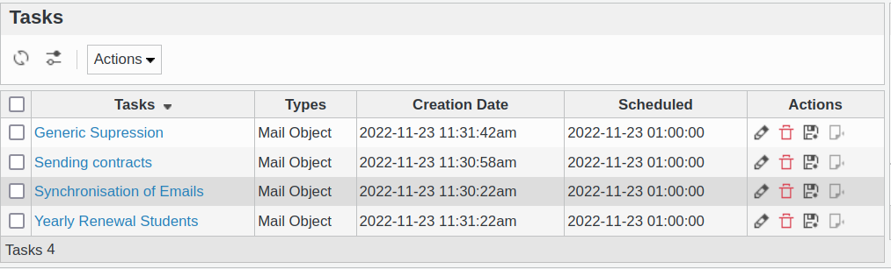
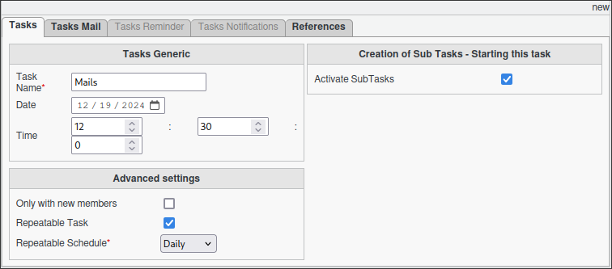
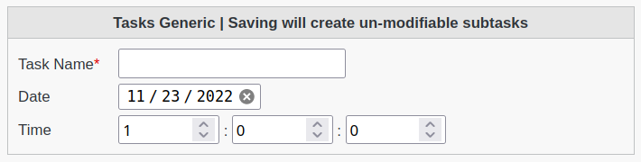
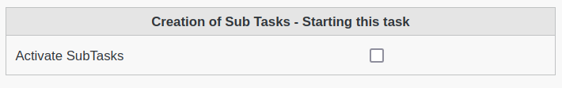
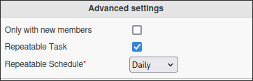

Tasks
-----

This page allows to manage Tasks objects

You can create new Tasks easily.

Mandatory settings of a task

* **Name**: Name of the task
* **Date**: Starting date of the task
* **Time**: Allows the schedule of the tasks to be timed in Hours:Minutes:Seconds format.

Select the type of tasks available.

* **Acticate Subtasks**: Allows the creation of subtasks which will be processed by FusionDirectory Orchestrator.

Within the advanced setting section

* **Only with new members**: It will only create sub-tasks for new members listed. (Great with dynamic group).
* **Repetable Task**: Repeatable task, allows the orchestrator-client to trigger the execution of the tasks automatically.
* **Repetable Schedule**: The schedule of automatic re-activation of the task.
