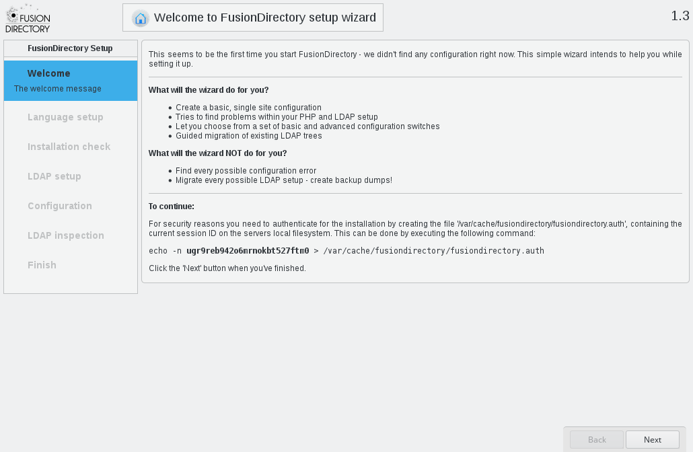
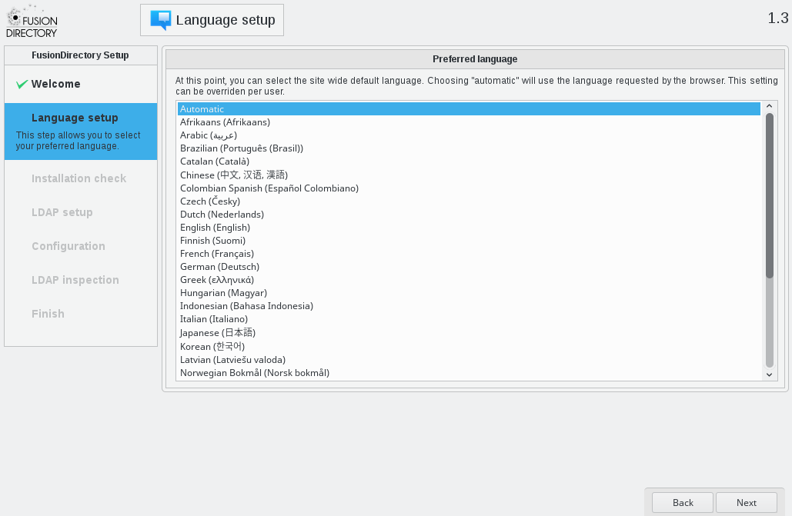
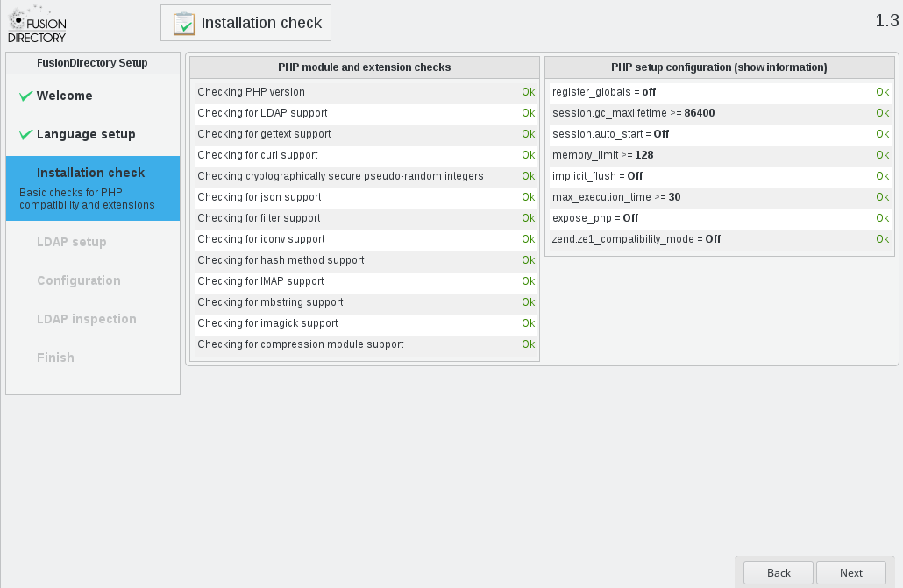
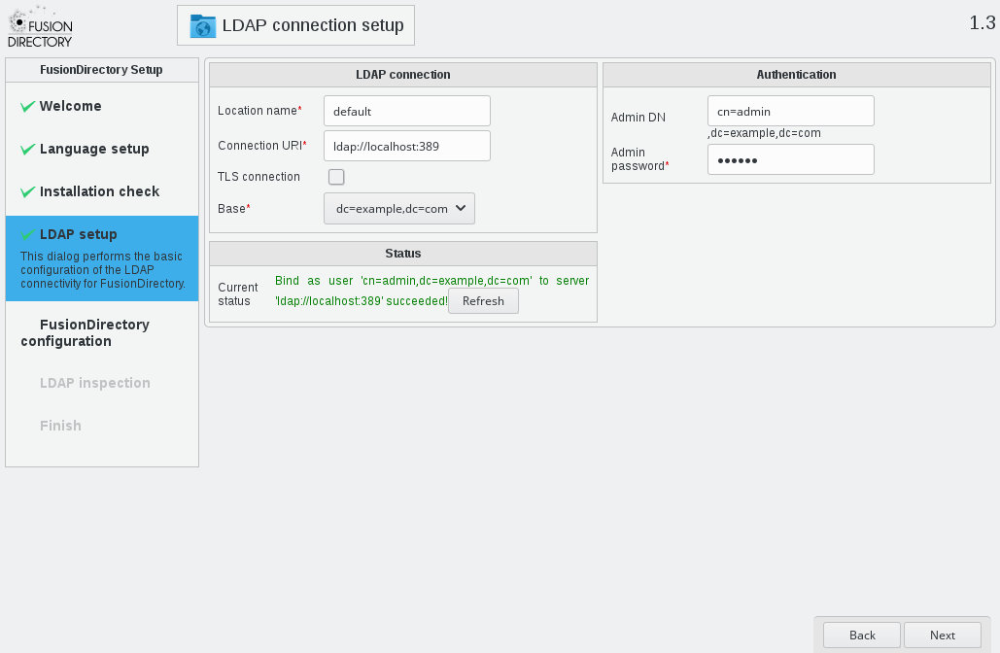
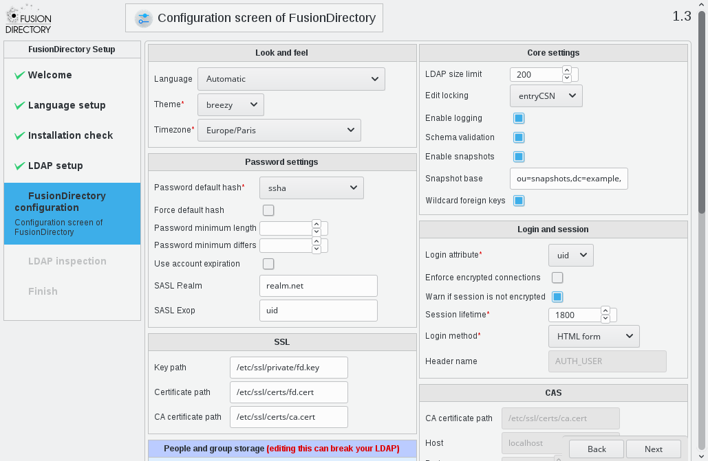
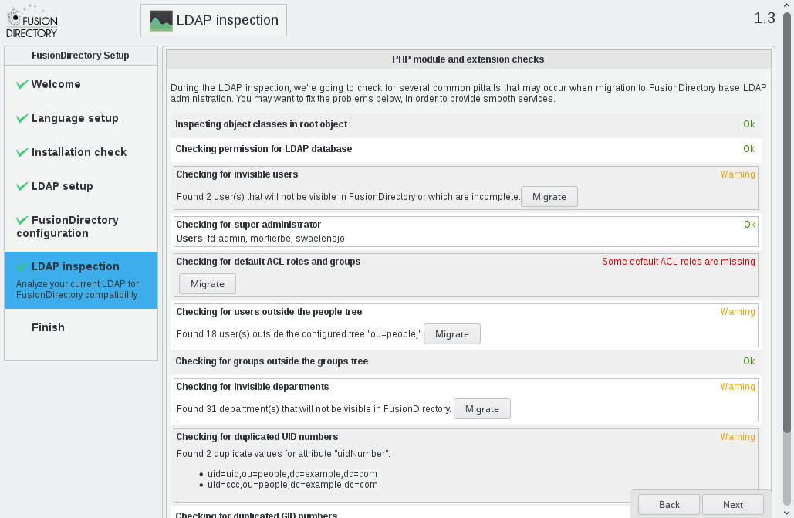
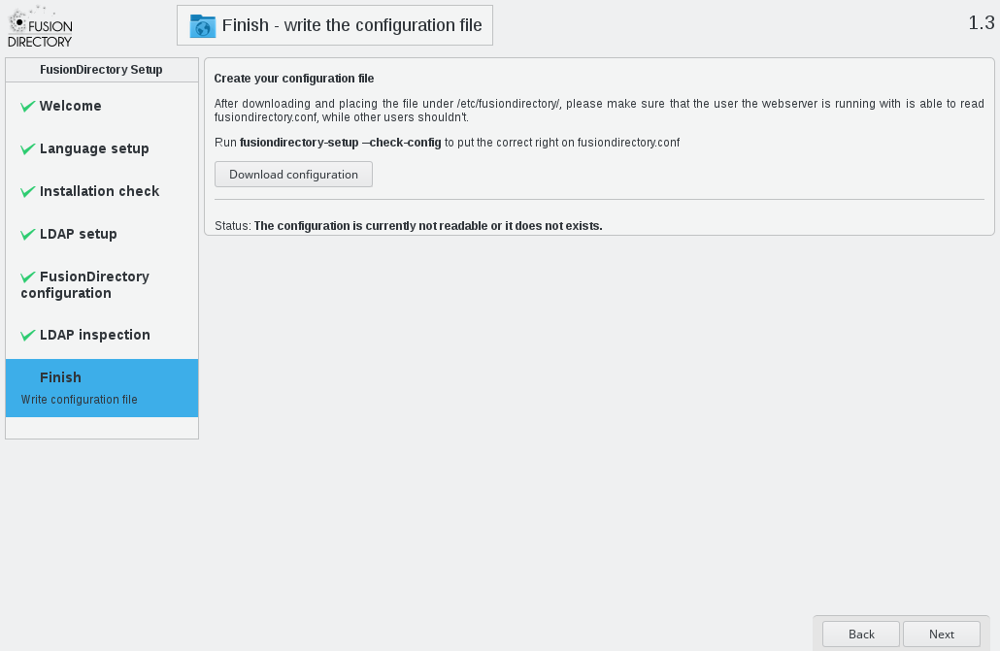
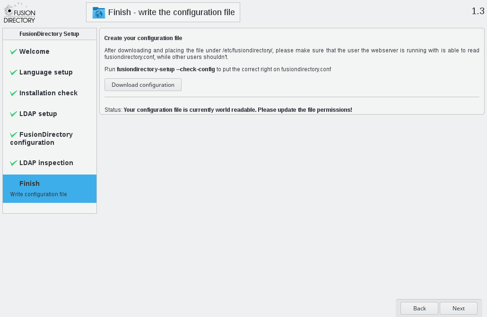

Setup FusionDirectory
'''''''''''''''''''''

Once FusionDirectory is installed you can load it in your browser and go through the web setup.

Welcome
^^^^^^^

The first step requires you to put a token in a file on the server, to make sure you have access to the server.

Note that you may need to replace the ">" by "| sudo tee" if you need to use sudo to access the location.

Language
^^^^^^^^

The second step simply lets you select the language in which FusionDirectory and the web setup should be displayed at.
If your browser is correctly set it’s better to select "Automatic" and let you browser ask FusionDirectory for your preferred language.

Checks
^^^^^^

The third step runs some checks on you PHP installation to make sure everything is installed and setup as needed by FusionDirectory.

LDAP
^^^^

The fourth step is where you indicate how to connect to you LDAP server.
You can use the refresh button to retry connection once you corrected the information.

Configuration
^^^^^^^^^^^^^

The fifth step is the configuration of FusionDirectory. You will be able to edit these settings later but be particularly careful about "people and group storage" section and of course the login settings so that you can connect to your FusionDirectory instance without trouble.

LDAP inspection
^^^^^^^^^^^^^^^

Then some more checks are run, this time about the content of your LDAP directory. If you have some content in there which is not organized as FusionDirectory would expect (or not located in the branches you indicated in the configuration step), you will be able to migrate them.

You can see the changes made to the LDAP before applying them.

Usually this is where you create an admin account for FusionDirectory, and inserting default ACL roles and groups is also a good idea, especially if you never used FusionDirectory before.

Finish
^^^^^^

You got to the end of the web setup. You now need to download the config file using the button, and store it in /etc/fusiondirectory on the server.

You may get this additionnal message if the permissions are wrong in which case you can run "fusiondirectory-configuration-manager --check-config" as root to fix those.

Once everything is fine, clicking next will redirect you to the login screen of your FusionDirectory installation.

