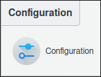
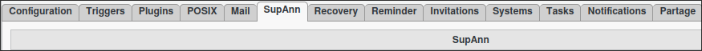
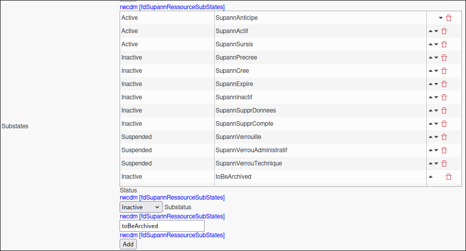
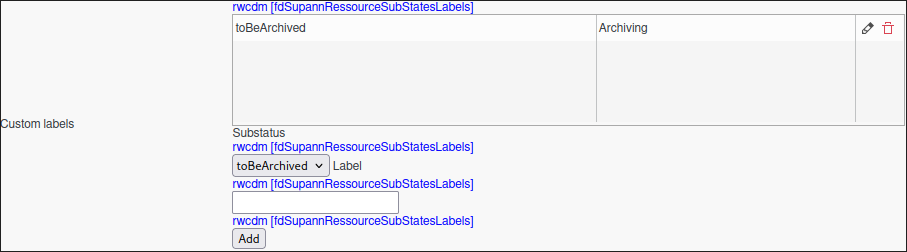

Archive Task
============

The **Archive** task is designed to streamline the management and archiving of user data. By leveraging the selected supann status, the task identifies matching statuses among the specified members and initiates the archiving process accordingly. 
This ensures a seamless and automated approach to data archiving, tailored to your organizational needs.

.. NOTE::
  It must be used with FusionDirectory Orchestrator and supann plugins must be installed.

Task Setup
----------

Creating the Task
-----------------

   - Open the **Tasks** section in FusionDirectory
   - Define the task’s schedule and repetition interval.
   - (Optional) - Decide if the task should be directly executed.

   .. image:: images/archive_t1.png
      :alt: Archive - Task creation step 1
      :width: 600px

Configuring Supann Plugin States (Optional)
-------------------------------------------

We recommend setting up a **custom substatus** within the **inactive status** in the configuration of Supann plugin states. 
This custom substatus can help you better categorize and manage archived data.

Steps to configure:

1. Navigate to the **Supann Plugin States** configuration section in FusionDirectory configuration.

2. Locate the **Inactive** status and substatus configuration.

3. Add a new custom substatus, such as `toBeArchived`, to clearly identify data that has been archived.

4. (Optional) Apply a custom label to the substatus for easier identification and filtering, if required.

5. Save your changes.

Benefits of using a custom substatus:

- Improved clarity in data categorization.
- Easier tracking of archived records.
- Enhanced control over data lifecycle management.

.. NOTE::

   Configuring a custom substatus is optional but highly recommended for better organization and management of archived data.

Configuring Archive Task
------------------------

- Go to the Tasks Archive tab.
- Select the desired supann state required to trigger the archiving process.
- Select your groups or individual members. 

.. NOTE::
    We strongly recommend the usage of dynamic groups.

- Click **Save**.

   .. image:: images/archive_t2.png
      :alt: Archive - Task creation step 2
      :width: 600px

Task Execution
--------------

For your configured task to execute, you need to configure your fusiondirectory-orchestrator-client.

See :ref:`Archive Task Execution <archive-task-execution-label>`. for more information.

Summary
-------

The **Archive Task**, when configured as described, will:

 - Automatically archive all data matching the selected supann status
 - Ensure efficient data management and archiving
 - Provide granular control over data lifecycle management