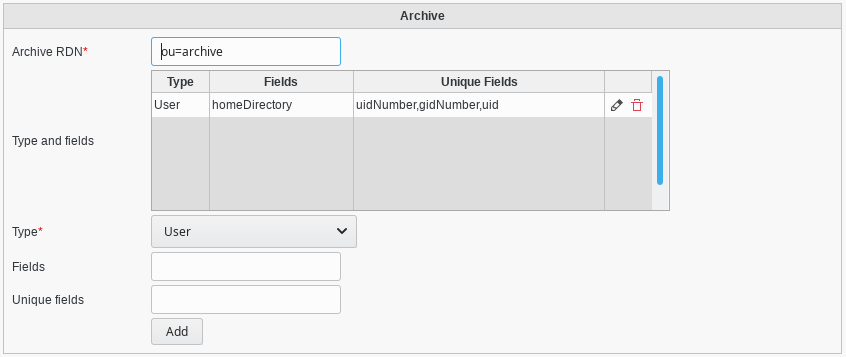

Configuration
=============

Click on Configuration icon on FusionDirectory main page

.. image:: images/archive-configuration-main.png
   :alt: Picture of Configuration icon in FusionDirectory

Click on Plugins tab

.. image:: images/archive-plugins-tab.png
   :alt: Picture of plugins tab in FusionDirectory   

Click on Edit button bottom right

.. image:: images/archive-edit-button.png
   :alt: Picture of Edit button in FusionDirectory   

Go to Archive section to configure 

   
Fill the following fields :

* **Archive RDN**: branch in which archived objects will be stored (required)
* **Type and fields**: configure in this attribute which type are archivable and which LDAP fields will be archived for these types. The format for fields is a comma separated list. Fields are split in two lists: one for fields archived for storing only, and one for fields archived for unicity contraints.

When you are done, click on the OK button to save your settings 

.. image:: images/archive-ok-button.png
   :alt: Picture of OK button in FusionDirectory

ACL
---

To give rights to a user to archive objects, you need to give him a creation right on the Archived Object item in the concerned category.
For instance, for someone to be able to archive users, you need to give him right "c" on user/archivedObject. Remember that archiving is deleting.
