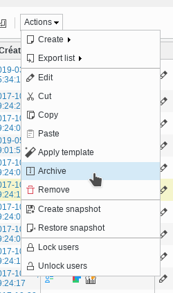
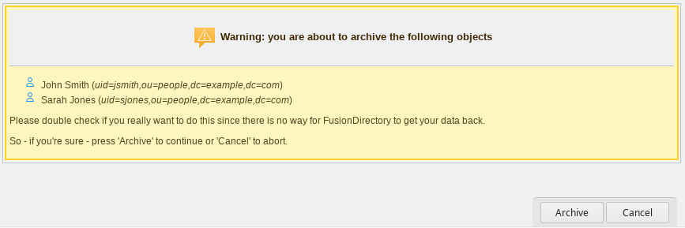
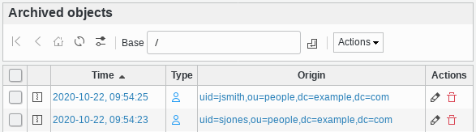

.. include:: /globals.rst

Functionalities
===============

Once you have configured archive for a given type, you will see an archive action in the management page for the given type.

As for any action you can use it from the icon in the action column, or by selecting objects and using the action from the action menu, allowing to archive several objects at once.

Once objects are archived, they are deleted, and you can consult the archived objects in the Archive page from the Reporting menu section.

You can open an archived object to read all archived information

.. image:: images/archived-object.png
   :alt: Picture of an opened archived object in FusionDirectory

