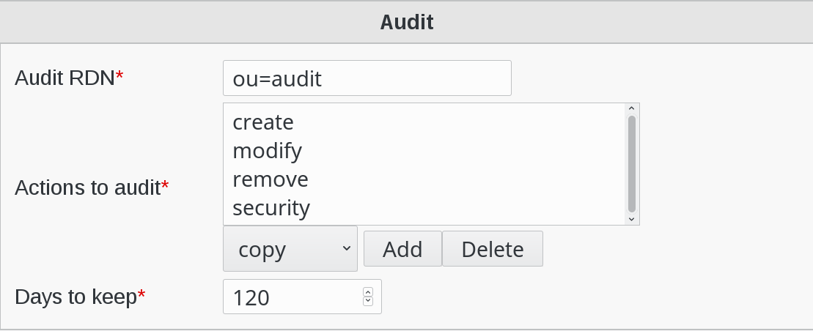

Configuration
=============

Click on Configuration icon on FusionDirectory main page

.. image:: images/audit-configuration-main.png
   :alt: Picture of Configuration icon in FusionDirectory

Click on Plugins tab

.. image:: images/audit-plugins-tab.png
   :alt: Picture of plugins tab in FusionDirectory   

Click on Edit button otom right

.. image:: images/audit-edit-button.png
   :alt: Picture of Edit button in FusionDirectory   

Go to Audit section to configure 

   
Fill the following fields :

* **Audit RDN** : branch in which audit events will be stored (required)
* **Actions to audit** : choose which actions should be stored in LDAP audit log (required)   
* **Days to keep** : number of days of audit to keep in the LDAP when cleaning (required)

When you are done, click on OK button bottom right to save your settings 

.. image:: images/audit-ok-button.png
   :alt: Picture of OK button in FusionDirectory
