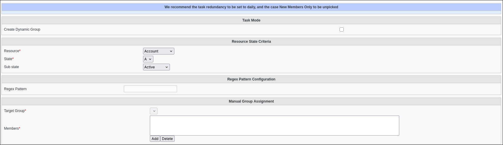

Automatic Groups task
=====================

The **Automatic Groups** task dynamically manages group memberships based on specific criteria.
It monitors users' Supann resource states and automatically adds or removes them from designated groups.

.. note::
   It must be used with FusionDirectory Orchestrator.

Task Setup
----------

Creating the Task
-----------------

   - Open the **Tasks** section of FusionDirectory
   - Define the task's schedule and repetition interval.

   .. image:: images/automaticGroups-p1.png
      :alt: Automatic Groups - Task creation step 1
      :width: 600px

Configuring Automatic Groups Task
---------------------------------

- **Navigate** to the **Tasks Automatic Groups** tab.

The automatic groups task supports two operating modes:

1. **Standard Group Assignment**: Adds or removes users from an existing group based on their Supann resource state criteria
2. **Dynamic Group Creation**: Creates a dynamic group with a memberURL filter matching the specified Supann resource state

How It Works
------------

Standard Group Assignment
^^^^^^^^^^^^^^^^^^^^^^^^^

When the standard automatic groups task executes:

1. The system identifies all users specified in the task configuration (either directly or through group membership)
2. For each user, it checks their Supann resource state against the criteria defined in the task
3. Users who match the criteria are added to the target group
4. Users who no longer match the criteria are removed from the target group

This ensures that group memberships remain synchronized with the current state of users in your directory.

.. note::
   Regex is available for the Supann resource criteria, allowing for flexible matching of (only) resource patterns.

Dynamic Group Creation
^^^^^^^^^^^^^^^^^^^^^^

When the dynamic group creation task executes:

1. The system generates a dynamic group name based on the resource, state, and optional substate
2. It builds an LDAP URL with a filter for the specified Supann resource state criteria
3. It creates a new dynamic group with the generated name and LDAP URL filter
4. If a group with the same name already exists, the task succeeds without modifying the existing group

The resulting dynamic group will automatically include all users whose Supann resource state matches the specified criteria, using LDAP's dynamic membership capabilities.

.. note::
   Regex is also available for the Supann resource (only) criteria in this mode. Creating a correct dynamic group related filter.

Dynamic Group Structure
-----------------------

Dynamic groups created by this task have the following structure:

- **Name Pattern**: dynamic-{resource}-{state}[-{substate}] (always lowercase)
- **LDAP URL**: ldap:///ou=people,{base_dn}??one?(supannRessourceEtat={resource}{state}[:substate])

For example, a dynamic group for resource "COMPTE" with state "A" would be:

- Name: dynamic-compte-a
- LDAP URL: ldap:///ou=people,dc=example,dc=com??one?(supannRessourceEtat={COMPTE}A)

Task Execution
--------------

For your configured task to be executed, you need to configure your fusiondirectory-orchestrator-client

Add the `--automatic-groups` parameter to your orchestrator client execution:

.. code-block:: bash

   fusiondirectory-orchestrator-client --automatic-groups   # For standard group assignment mode
   fusiondirectory-orchestrator-client --automatic-groups dynamic-group # For dynamic group creation mode

This can be scheduled via cron for regular execution.

Summary
-------

The **Automatic Groups Task**, when configured as described, will:

- **Process** each user from the selected members list.
- **Check** if they meet the specified Supann resource state criteria.
- **Add** users to the target group if they match the criteria.
- **Remove** users from the target group if they no longer match the criteria.

If using **dynamic group creation**, it will:

- **Create** a dynamic group with a name based on the resource, state, and optional substate.
- **Set** the group's memberURL to filter users based on the specified Supann resource state criteria.
- **Skip** creation if a group with the same name already exists.

.. note::
   This ensures group memberships are always in sync with users' current states, automating what would otherwise be a manual administrative task.