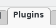
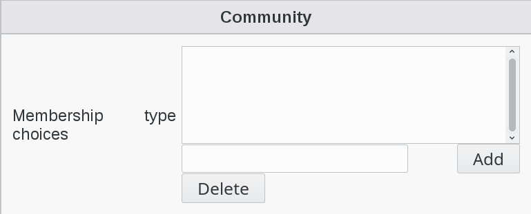

Configuration
=============

If you need to modify something, you can access to FD configuration of the plugin by the 'Configuration' icon or entry in the 
'Addons' section of the main page of FusionDirectory Configutation Interface: 

.. image:: images/community-configuration.png
   :alt: Picture of Community configuration in FusionDirectory
   
Go to Plugins tab

Click on Edit button bottom right

Fill-in Community options

Click on OK button bottom righ to save your options

.. image:: images/community-ok.png
   :alt: Picture of Community options in FusionDirectory 
