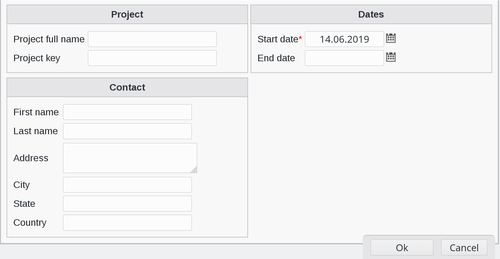
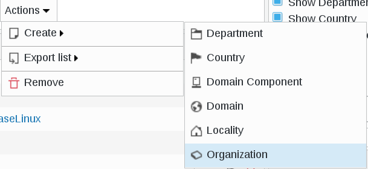
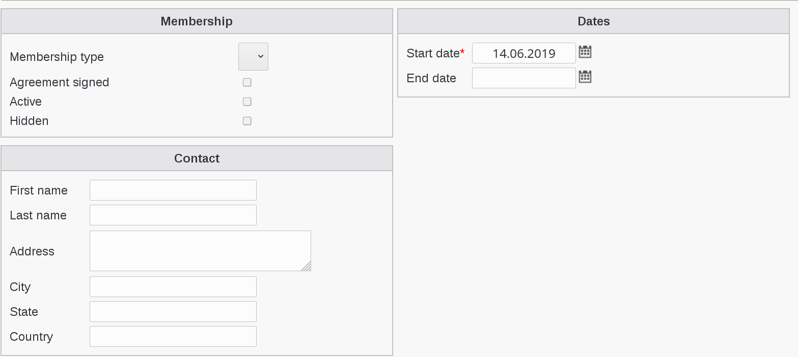

.. include:: /globals.rst

Functionalities
===============

* Create a department

Click on Departments icon in FusionDirectory

Click on Actions --> Create --> Department

Go to Community Project tab

Click on Add Community projects settings

Fill-in all required fields

Click on OK button bottom right to save settings

* Create an organization

Click on Departments icon in FusionDirectory

Click on Actions --> Create --> Organization

Click on Community organization tab

Click on Add Community organization settings

Fill-in all required fields

Click on OK button bottom right to save settings

