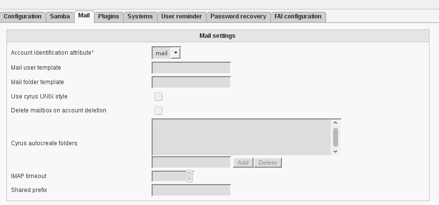

Configuration
=============

If you need to modify something, you can access to FD configuration of the plugin by the 'Configuration' icon or entry in the 
'Addons' section of the main page of FusionDirectory Configutation Interface: 

.. image:: images/cyrus-configuration.png
   :alt: Picture of Cyrus configuration in FusionDirectory
   
   
* Cyrus mail configuration

Access to configuration is read-only. If you need to make changes, then you must press the 'Edit' button at the bottom right of the window.

In Mail tab you will find the configuration of the cyrus plugin.  

   
   
Mail settings

    * Account identification attribute: (required) Determines which attribute FusionDirectory will use to create accounts. Valid values are mail and uid.
    * Mail user template: Allows to override the user account creation syntax. See the 'Mail folder template' description for more details.

    Examples:

.. code-block:: bash

     %prefix%%uid%           => user.foobar 
     
     
.. code-block:: bash

     my-prefix.%uid%%domain%  => my-prefix.foobar@example.com 

* Mail folder template: Allows to override the methods default account creation syntax.

    Examples:
    
    
.. code-block:: bash

     %prefix%%cn%              => shared.development 
     

.. code-block:: bash     

     my-prefix.%cn%%domain%    => my-prefix.development@example.com 
     
     
* Placeholders for the Mail folder template usage:
    
    
    
.. code-block:: bash

     %prefix%    The methods default prefix. (Depends on 'Use cyrus UNIX style') 
     
.. code-block:: bash     

     %cn%        The groups/users cn. 
     
.. code-block:: bash     

     %uid%       The users uid. 
     
.. code-block:: bash     

     %mail%      The objects mail attribute. 
     
.. code-block:: bash     

     %domain%    The domain part of the objects mail attribute. 
     
.. code-block:: bash     

     %mailpart%  The user address part of the mail address. 
     
.. code-block:: bash     

     %uattrib%   Depends on mailAttribute (uid/mail). 
     

* Use cyrus UNIX style: Determines if FusionDirectory should use “foo/bar” instead of “foo.bar” namespaces in IMAP. Unix style is with slashes.
    
    
To use this option, you must set 'unixhierarchysep' parameter to 'yes' in your imap.conf configuration file.

.. code-block:: bash

     unixhierarchysep: yes 

* Delete mailbox on account deletion: Determines if FusionDirectory should remove the mailbox from your IMAP server or keep it after the account is deleted in LDAP.
* Cyrus autocreate folders: Contains a comma separated list of personal IMAP folders that should be created along initial account creation.
* IMAP timeout: Sets the connection timeout for imap actions. Default value is 10 seconds.
* Shared prefix: Defines the prefix to add for mail shared folders.

   
   
   

   

