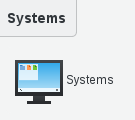
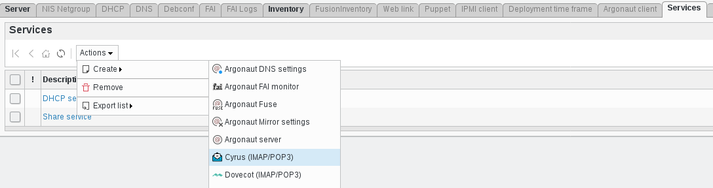
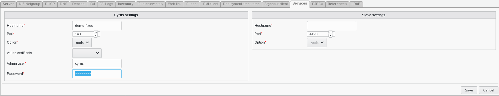

.. include:: /globals.rst

Functionalities
===============

* Add Cyrus service

Click on the System button located in the System section of FusionDirectory main page

   
   
Click on the server you wish to configure cyrus service, in this exemple we assume that the server name is 'demo-fixes'

   
   
Click on 'Services' tab and click on 'action - create - cyrus IMAP/POP3:    

   
   
Fill in required fields then click 'Save': 

   
   
Cyrus settings

    * Hostname: Hostname of the Cyrus server.
    * Port: Port number on which Cyrus server should be contacted.
    * Option: (required) Options for contacting Cyrus server. Valid values are notls, tls and ssl.
    * Valide certificats: Whether or not to validate server certificate on connexion. Valid values are validate and no-validate.
    * Admin user: (required) Imap server admin user.
    * Password: (required) Admin user password.
    
    
Sieve settings

    * Hostname: Hostname of the Cyrus Sieve server.
    * Port: Port number on which Cyrus Sieve server should be contacted.
    * Option: (required) Options for contacting Cyrus Sieve server. Valid values are notls, tls and ssl.
    
    
Click on 'save'

Now, in services column, you can see the cyrus icon:     

   
   
From now you can create User Mailbox   

    
   

