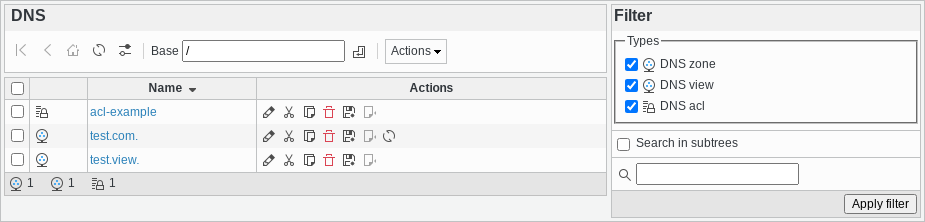

.. include:: /globals.rst

Management
----------

Clicking the DNS entry from the main menu, you will get to the DNS management page.

On this page you can create and manage three types of objects:

* Zones
* ACLs
* Views
