.. include:: /globals.rst

Zone
----

A DNS zone with all the records it contains.

  .. image:: images/dns-zone.png
     :alt: Edition of a DNS Zone object

Zone
^^^^

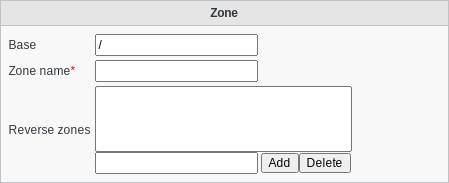

* Base: Object base
* Zone name: Zone name
* Reverse zones: Reverse zones for this zone in the form xx.xx.in-addr.arpa. or x.x.ip6.arpa.

SOA record
^^^^^^^^^^

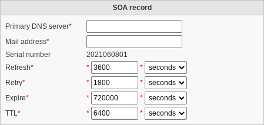

* Primary DNS server: Domain name of the name server that was the original or primary source of data for this zone
* Mail address: Domain name which specifies the mailbox of the person responsible for this zone
* Serial number: Version number of the original copy of the zone
* Refresh: Time interval before the zone should be refreshed
* Retry: Time interval that should elapse before a failed refresh should be retried
* Expire: Time value that specifies the upper limit on the time interval that can elapse before the zone is no longer authoritative
* TTL: Minimum TTL field that should be exported with any RR from this zone

Records
^^^^^^^

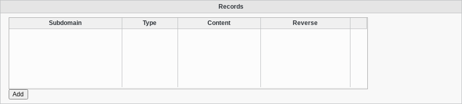

The DNS records for this zone

Supported record types:

* A

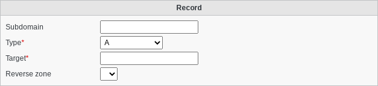

* AAAA

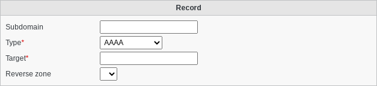

* AFSDB

* CAA

* CERT

* CNAME

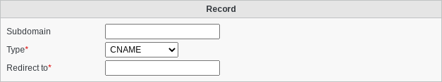

* DKIM (TXT)

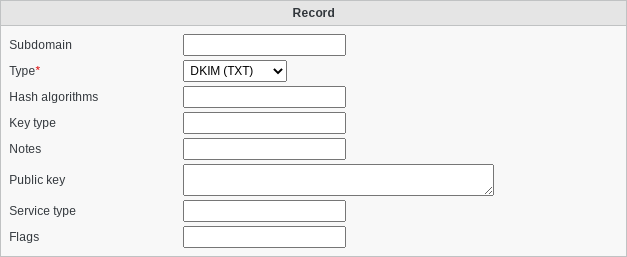

* DMARC (TXT)

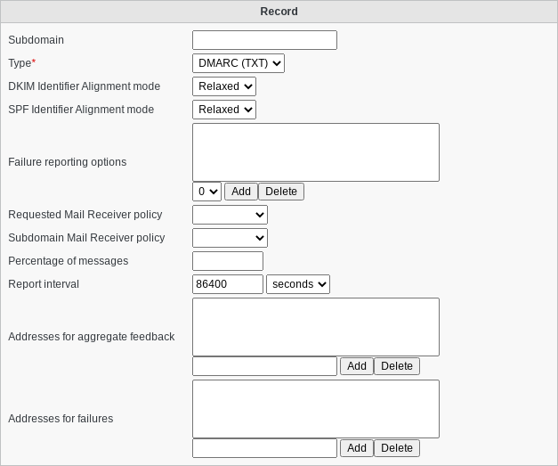

* DS

* KEY

* KX

* LOC

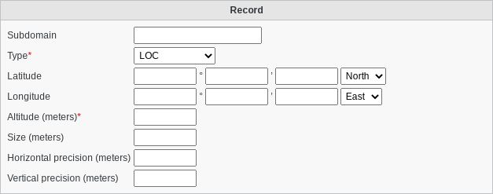

* MX

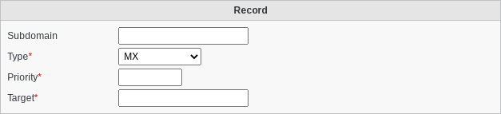

* NAPTR

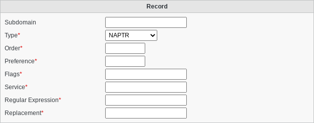

* NS

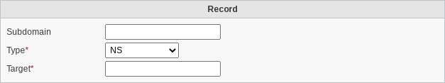

* NSEC

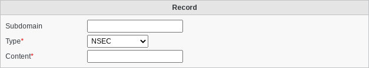

* PTR

* RRSIG

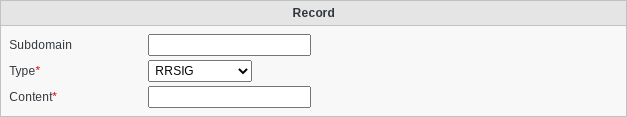

* SIG

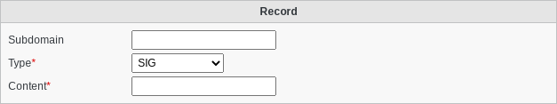

* SPF (TXT)

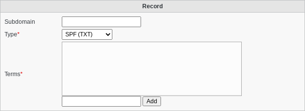

* SRV

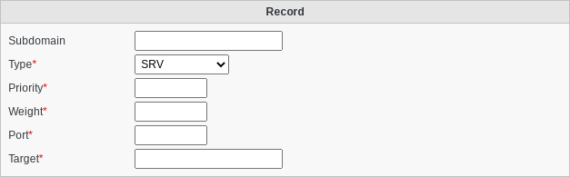

* SSHFP

* TXT

The records with (TXT) appended are actually stored as TXT records in the zone, but FusionDirectory still provides a specific interface to help you correctly use them.
