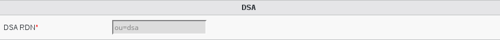

Configuration
=============

If you need to modify something, you can access to FD configuration of the plugin by the 'Configuration' icon or entry in the 
'Addons' section of the main page of FusionDirectory Configutation Interface: 

.. image:: images/dsa-configuration.png
   :alt: Picture of DSA configuration in FusionDirectory
   
   
Access to configuration is read-only. If you need to make changes, then you must press the 'Edit' button at the bottom right of the window.

In Plugins tab you will find the block DSA, which is related to the configuration of the Dsa plugin

    * DSA RDN: (required) Branch in which Directory Service Account (dsa) will be stored  

