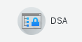
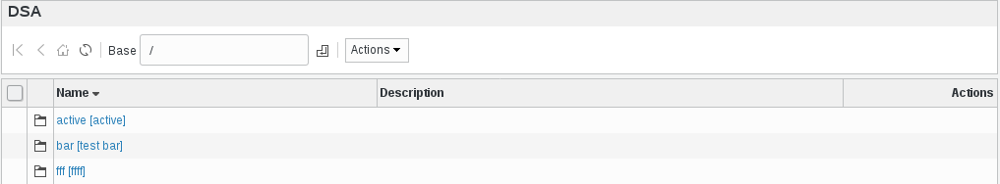
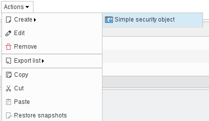
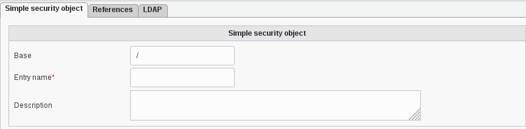
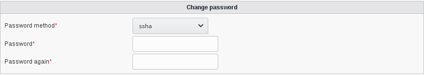

.. include:: /globals.rst

Functionalities
===============

How use custom the DSA plugin
^^^^^^^^^^^^^^^^^^^^^^^^^^^^^

In your FusionDirectory Web interface, in the "Users and Groups" section, you will find an icon called “DSA” that you can use to manage service accounts in your ldap directory : 

* Create a DSA account

Click on the 'DSA' entry or icon, in users and groups section, to join the 'DSA management' page.

Now you can add a new account (simple security object) via 'Actions –> Create' (or modify the existing ones):

   
   
A new dialog is open, fill at least in required fields:

   * Base : object base
   * Entry Name : (required) Service Account name

   

* Change password

Fill in the required fields :

    * Password method: (required) Password hash method to use
    * Password: (required) Service Account password
    * Password again: (required) Same password as above, to avoid errors

      

    
