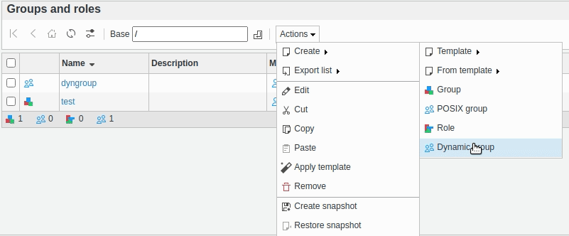
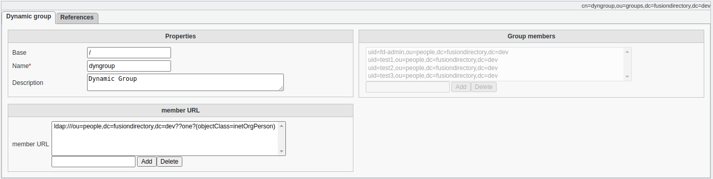

.. include:: /globals.rst

Functionalities
===============

Dyngroup plugin lets you manage groupOfURLs objects within FusionDirectory just like regular groups and roles.

You can go to the "Groups and roles" page and create a dynamic group.

You can configure memberURL attribute and see how member attribute is populated with entries that match the memberURL attribute.

The created groups will appear in the list with other groups.

.. image:: images/dyngroup-management-page.png
   :alt: Picture of dynamic group in group list

.. note::
  Dynamic group requires dynlist and autogroup overlays to be installed in your LDAP directory.
