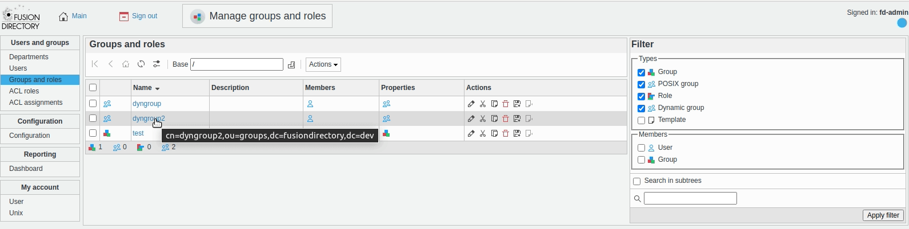

.. include:: /globals.rst

Functionalities
===============

Dyngroup plugin let you manage groupOfURLs objects within FusionDirectory just like regular groups and roles. You can configure memberURL attribute and see how member attribute is populated with entries that match the memberURL attribute.

.. note::

  Dynamic group requires dynlist and autogroup overlays to be installed in your LDAP directory.
