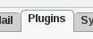
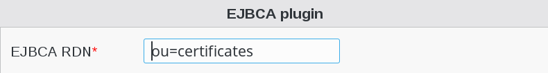

Configuration
=============

If you need to modify something, you can access to FD configuration of the plugin by the 'Configuration' icon or entry in the 
'Addons' section of the main page of FusionDirectory Configutation Interface: 

.. image:: images/ejbca-configuration.png
   :alt: Picture of EJBCA configuration in FusionDirectory

Go to Plugins tab

   
Click on Edit button bottom right

Fill-in EJBCA RDN

Click on OK button bottom right to save

.. image:: images/ejbca-ok.png
   :alt: Picture of ok button in FusionDirectory

