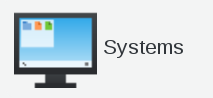

.. include:: /globals.rst

Functionalities
===============

* Assign a certificate at a user 

Click on Users icon in FusionDirectory

Click on Actions --> Edit

Activate EJBCA tab

Click on EJBCA settings button

   
Select a certificate from the list

.. image:: images/ejbca-certs.png
   :alt: Picture of EJBCA certs window in FusionDirectory
   
Click on Apply button bottom right to save

* Assign a certificate at a system 

Click on Systems icon in FusionDirectory

Click on Actions --> Create --> Server 

   

Activate EJBCA tab

   

Click on EJBCA settings button

      
   
Select a certificate from the list

.. image:: images/ejbca-certs.png
   :alt: Picture of EJBCA certs window in FusionDirectory
   
Click on Apply button bottom right to save

   
Click on OK button bottom right to save

   
* Add a certificate

Click on EJBCA icon in FusionDirectory

   
EJBCA part in FusionDirectory  

   
You can download your certificate here, but you may click on his name and see more info       
