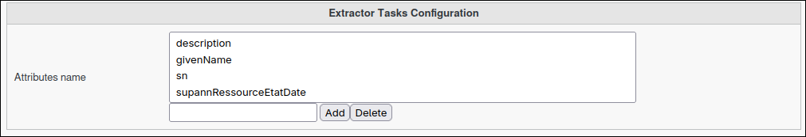

Configuration
=============

The Extractor plugin supports backend configuration using the **Extractor Tasks Configuration** object.

You can define which LDAP attributes are available for extraction by editing this configuration in the FusionDirectory interface.

To configure:

- Go to *Configuration* in FusionDirectory.
- Add or edit the **Extractor Tasks Configuration** entry.
- Set the list of allowed attributes in the *Attributes name* field (multi-valued).

