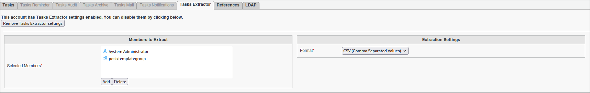

Extractor Task
==============

.. note::
   It must be used with FusionDirectory Orchestrator and requires the `--extract` option.

CSV Header Behavior
-------------------

The **Extractor Task** dynamically generates the headers of the CSV file based on the attributes collected from the selected users, user groups, or dynamic groups.

- If some users have attributes that others do not, the CSV file will adapt by including all attributes as headers, leaving empty values for undefined attributes.
- This ensures that the CSV file is properly formatted and contains all relevant data, even when the attributes vary between users.
- You can control which LDAP attributes are available for extraction by configuring the **Extractor Tasks Configuration** in the FusionDirectory configuration section.

File Generation Behavior
------------------------

The **Extractor Task** generates files based on the hour of the day. Each task execution during the same hour creates a unique file, ensuring no duplication.

- Files are named in the format `NameOfTheTask-date_hour_uniqueid.csv` (e.g., `MyTask-20250407-14_1a2b3c4d.csv`).
- A new file is created for each subsequent hour or each execution, with a unique identifier to prevent overwriting.

This behavior ensures efficient data management and prevents duplication while maintaining up-to-date information in the generated files.

Task Setup
----------

Creating the Task
-----------------

- Open the **Tasks** section of FusionDirectory.
- Define the task’s schedule and repetition interval.

  .. image:: images/extractor-p1.png
     :alt: Extractor - Task creation step 1
     :width: 600px

.. note::
   The task can not use the option "Only with new members", to have it ticked won't result into a scenario where only the extracted data of new users is performed.
   The extraction is always performed for all users, groups, or dynamic groups selected in the task configuration.

Configuring Extractor Task
--------------------------

- **Navigate** to the **Tasks Extractor** tab.
- **Select** the output format desired (e.g., CSV).
- **List** the users, static groups, or dynamic groups requiring data extraction.
- **Optionally define** the output directory. By default, files are saved in `/srv/orchestrator`.
- **Assign** the relevant members.
- **Choose** which LDAP attributes to extract, or leave empty to extract all available attributes as defined in the Extractor Tasks Configuration.

.. note::
   You can select either a **static group** or a **dynamic group** for greater flexibility.

.. note::
   You cannot use posix groups with this task 

Task Execution
--------------

For your configured task to be executed, you need to configure your `fusiondirectory-orchestrator-client` with the `--extract` option.

See :ref:`Extractor Task Execution <extractor-task-execution-label>` for more information.

Summary
-------

The **Extractor Task**, when configured as described, will:

- **Analyze** the selected users, groups, or dynamic groups.
- **Generate** a CSV file containing the collected attributes as headers.
- **Adapt** the headers dynamically to account for undefined attributes.
- **Allow** you to select which LDAP attributes to extract, as defined in the backend configuration.
- **Ensure** no duplication by creating a new file for each execution and updating existing data as needed.

.. note::
   This ensures efficient data extraction and up-to-date file generation.
