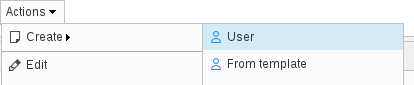
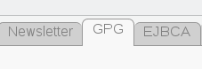
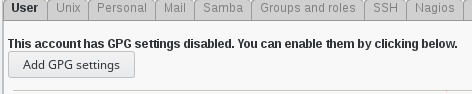
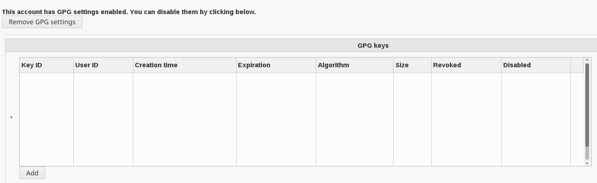

.. include:: /globals.rst

Functionalities
===============

* Create a user

Click on "users" icon in FusionDirectory

   
   
Click on Actions  --> create -->  user  

   
   
Activate GPG tab   

   
   
Click on Add GPG settings   

   
   
Add a key that is in your LDAP   

   
   
Thick the key and save it    
