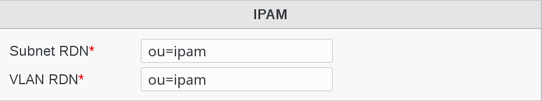

Configuration
=============

Click on Configuration icon in FusionDirectory main page

   
Click on Plugins tab

Click Edit button bottom right and go down to Ipam configuration menu

   
and go down to Ipam configuration menu   

   
Fill-in the following fields :

* **Subnet RDN** : branch in which ipam subnets info will be stored (required)
* **VLAN RDN** : branch in which ipam vlan info will be stored (required)

Click OK button bottom right to save your settings

