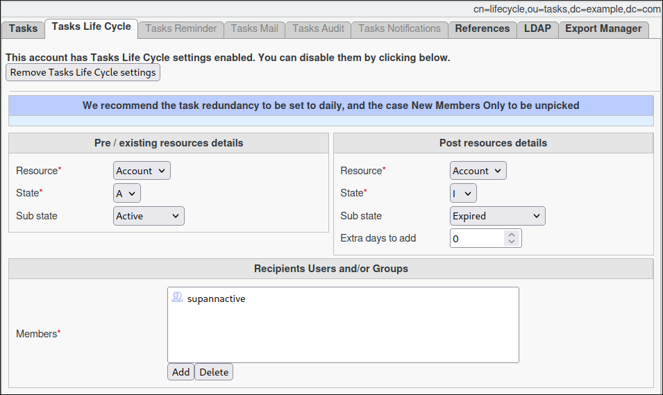

Life Cycle
==========

The **Life Cycle** task manages the end of life of your accounts.
It uses the end date of a targeted Supann resource and allows for modification, prolongation, or change of state.

.. note::
   It must be used with FusionDirectory Orchestrator.

Task Setup
----------

Creating the Task
-----------------

   - Open the **Tasks** section of FusionDirectory
   - Define the task’s schedule and repetition interval.

   .. image:: images/lifeCycle-p1.png
      :alt: Life cycle - Task creation step 1
      :width: 600px

Configuring Life Cycle Task
---------------------------

- **Navigate** to the **Tasks Life Cycle** tab.
- **Select** the resource, state, and (optionally) sub-state to monitor for expiration in the **left section**.
- **Choose** the resource, state, and (optionally) sub-state to be assigned after the expiration of the previous resource in the **right section**.
- **Define** the extra days to extend the new resource’s **end date**. The calculation begins from the last end date of the previous resource.
- **Assign** the relevant members.

.. note::
   You can select either a **static group** or a **dynamic group** for greater flexibility.

Task Execution
--------------

For your configured task to be executed, you need to configure your fusiondirectory-orchestrator-client

See :ref:`Life Cycle Task Execution <lifecycle-task-execution-label>`. for more information.

Summary
-------

The **Life Cycle Task**, when configured as described, will:

- **Analyze** the Supann resource for the targeted user on a **daily basis**.
- **Check** if the configured state has expired.
-  **If expired**, update the Supann resource to the desired configuration.

.. note::
   This ensures automatic resource management and helps maintain up-to-date configurations.

