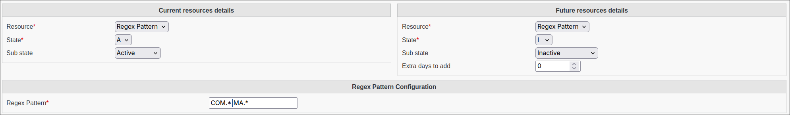
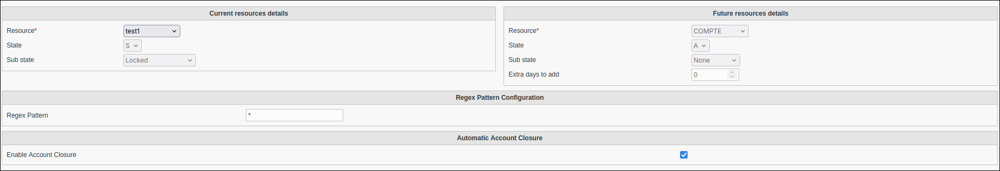
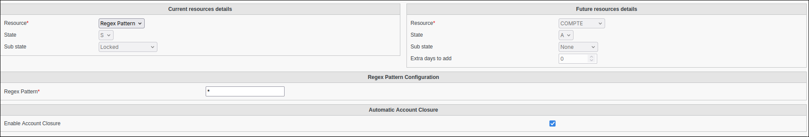

Life Cycle task
===============

The **Life Cycle** task automates the management of user account states and resource validity based on SupannΕtatRessource attributes. It allows for modifying resource states, extending their validity, or triggering account closure based on predefined conditions and expiration dates.

.. note::
   This task requires the FusionDirectory Orchestrator and the orchestrator-client to be configured for execution.

Task Setup
----------

Creating the Task
-----------------

1.  Navigate to the **Tasks** section within FusionDirectory.
2.  Create a new task and define its **Name**, **Schedule** (e.g., daily), and **Repetition Interval**.

   .. image:: images/lifeCycle-p1.png
      :alt: Life cycle - Task creation step 1
      :width: 600px

Configuring Life Cycle Task
---------------------------

The core configuration happens in the **Tasks Life Cycle** tab. You define conditions under which a user's Supann resources are modified.

There are two main aspects to configure:

1.  **Current resources details**: Defines the resource(s) to monitor for expiration.
2.  **Future resources details**: Defines how a target resource should be modified once the "Current" condition is met.

**Method 1: Using Specific Resource Names**

This method monitors a specific, named Supann resource for expiration and updates another (or the same) specific, named resource.

- In the **Current resources details** section:
    - **Resource**: Select the specific Supann resource name to monitor (e.g., ``{MAIL}``).
    - **State**: Select the state of this resource that indicates it's the one to monitor (e.g., ``A`` for Active).
    - **Sub-state** (Optional): Further refine the monitored resource by its sub-state.
- In the **Future resources details** section:
    - **Resource**: Select the specific Supann resource name that will be modified. This resource **must already exist** on the user.
    - **State**: Choose the new state to assign to this target resource.
    - **Sub-state** (Optional): Choose the new sub-state.
    - **Extra days to add**: Define how many days to add to the target resource's new end date. The calculation uses the target resource's *original end date* as the new *start date*.
- **Assign** the relevant members (users/groups) to this task.

.. note::
   When **Sub-state** is set to "None", it means that any "Resources" and "States" matching the definition—regardless of their "Sub-state"—will be considered a match. In this case, the "Sub-state" is ignored entirely; whether it is set or not has no effect on the matching logic.

.. image:: images/lifeCycle-p2.png
  :alt: Life cycle - Task configuration with specific resources
  :width: 600px

**Method 2: Using Regex to Define Resources**

This method allows monitoring or targeting resources based on a name pattern.

- In the **Current resources details** section:
    - **Resource**: Select ``REGEX``. This activates the "Regex Pattern Configuration" section.
    - **State**: Define the state to monitor in conjunction with the regex pattern.
    - **Sub-state** (Optional): Define the sub-state.
- In the **Regex Pattern Configuration** section:
   - **Regex Pattern**: Enter the regular expression to match against the names of the user's Supann resources (the part within ``{}``, e.g., "COMPTE", "MAIL").
      - A single asterisk ``*`` will be treated as ``.*`` (match any character sequence), effectively matching all resource names.
      - Example: ``^MAIL.*`` matches resource names starting with "MAIL".
- In the **Future resources details** section:
    - **Resource**: You can select a specific resource name or ``REGEX``.
        - If ``REGEX`` is selected here, the same "Regex Pattern" from the "Regex Pattern Configuration" section will be used to identify target resources.
        - If a specific name is selected, that named resource will be targeted (it must exist on the user).
    - **State**, **Sub-state**, **Extra days to add**: Configure as in Method 1.
- **Assign** the relevant members.

.. note::
   When using REGEX in "Current resources details", if any resource matching the pattern and state/sub-state is found to be expired, the user becomes eligible for the "Future" update.

.. note::
   You can assign members using **static groups** or **dynamic groups** for flexible targeting.

Resource State Modification Behavior
------------------------------------

The task processes users in two main phases for resource state modifications (this is separate from Automatic Account Closure):

1.  **Eligibility Check:**
    For each assigned user, the task checks if *any* of their Supann resources meet the expiration criteria defined by the **Current resources details** (and **Regex Pattern** if "Current Resource" is ``REGEX``). A resource is considered eligible if its end date has passed. If no such expired monitored resource is found, no further state modification action is taken for that user.

2.  **Update Execution:**
    If an eligible expired resource is found, the task determines which *existing* user resource(s) to update based on the **Future resources details**. The **name of the target resource is always preserved**.

    *   **Scenario A: Monitored Resource = Static Name, Target Resource = Static Name**

        *   **Trigger:** The specific static resource in "Current resources details" is expired.
        *   **Action:** Targets the *existing* user resource matching the name in "Future resources details".
        *   **Update:** If found and has a valid original end date, this target resource's state, sub-state, and dates are updated. Its original end date becomes the new start date, and "Extra days" are added to calculate the new end date.

    *   **Scenario B: Monitored Resource = Regex Pattern, Target Resource = Static Name**

        *   **Trigger:** *Any* user resource matching the "Current" Regex Pattern and state/sub-state is expired.
        *   **Action:** Targets the *existing* user resource matching the name in "Future resources details".
        *   **Update:** Same as Scenario A.

    *   **Scenario C: Monitored Resource = Static Name, Target Resource = Regex Pattern**

        *   **Trigger:** The specific static resource in "Current resources details" is expired.
        *   **Action:** Targets *all existing* user resources matching the "Future" Regex Pattern (from "Regex Pattern Configuration").
        *   **Update:** Each found resource with a valid original end date is updated as in Scenario A.

    *   **Scenario D: Monitored Resource = Regex Pattern, Target Resource = Regex Pattern**

        *   **Trigger & Action:** The task identifies user resources that:

            1. Match the **Regex Pattern** by name, AND
            2. Match the state/sub-state in "Current resources details", AND
            3. Are expired.
        *   **Update:** *Each such identified resource* is updated as in Scenario A, preserving its name.

.. note::
   **Example (Illustrating Scenario A for State Modification):**
  
   A user has an expired ``{MAIL}`` resource (e.g., ``{MAIL}X:Y:startDate:20241231``).
   Your task is configured for state modification (Account Closure disabled) with:
  
   - **Current resources details:** Resource=``MAIL``, State=``X``, Sub-state=``Y``
   - **Future resources details:** Resource=``COMPTE``, State=``A``, Sub-state=``B``, Extra days=``30``

   The task will:
 
   1. Detect the expired ``{MAIL}`` resource matching state X, sub-state Y.
   2. Find the *existing* ``{COMPTE}`` resource on the user (e.g., ``{COMPTE}Z:W:otherStartDate:20250115``).
   3. If ``{COMPTE}`` exists and its end date ``20250115`` is valid:
      - The ``{COMPTE}`` resource's new state becomes ``A``, sub-state becomes ``B``.
      - Its new start date becomes ``20250115`` (its original end date).
      - Its new end date becomes ``20250115`` + 30 days.
      The resource string would change from ``{COMPTE}Z:W:otherStartDate:20250115`` to ``{COMPTE}A:B:20250115:newEndDate``.

.. tip::
   For predictable lifecycle management of a single resource type, it's often best to have the "Current Resource" and "Future Resource" refer to the same resource name (e.g., monitor ``{COMPTE}`` to update ``{COMPTE}``, or use REGEX for "XYZ" in both Current and Future if targeting by pattern). The flexibility to use different names is for specific advanced scenarios.

.. warning::
   - The resource(s) targeted for modification **must already exist** on the user and **must have a valid end date**. This original end date is critical as it becomes the new start date for the updated resource.
   - The task **only modifies the state, sub-state, and dates** of targeted existing resource(s). The **name of the targeted resource itself is never changed** by this state modification process.
   - If a targeted resource is not found (Scenarios A & B) or lacks a valid end date, the update for that specific resource is skipped, and an error may be logged.

.. _lifecycle-automatic-account-closure:

Automatic AccountClosure
------------------------

This feature allows the Life Cycle task to automatically lock a user's main account (typically ``{COMPTE}``) when other specified services or resources are no longer active. This is distinct from the resource state modification behavior described above.

**Enabling the Feature:**

- Navigate to the **Tasks Life Cycle** tab.
- Go to the **Automatic Account Closure** section.
- Check the **Enable Account Closure** box.

**Configuration:**

- When "Enable Account Closure" is ticked, the task uses the settings from:
    - **Current resources details** (Resource, State, Sub-state)
    - **Regex Pattern Configuration** (if "Resource" in "Current resources details" is set to ``REGEX``)
- These settings define which of the user's Supann resources are monitored to determine if the account closure should proceed.
- The **Future resources details** section is generally ignored or disabled by the UI when "Enable Account Closure" is active, as the action is specifically to lock the ``{COMPTE}`` resource.

**Behavior:**

1.  The task identifies all user resources matching the criteria in "Current resources details" (and "Regex Pattern" if applicable).
2.  It then checks if *any* of these monitored resources are in an **Active (A)** state. Crucially, the ``{COMPTE}`` resource itself is *excluded* from this "active check."
3.  **If none of the monitored resources (excluding ``{COMPTE}``) are found to be Active (A)**, the system proceeds to modify the user's ``{COMPTE}`` resource.
4.  The ``{COMPTE}`` resource is typically updated as follows:

    - State: ``S`` (Suspended)
    - Sub-state: ``SupannVerrouAdministratif``
    - Start Date: Current date
    - End Date: None
    - Example resulting string: ``{COMPTE}S:SupannVerrouAdministratif:YYYYMMDD:``

**Use Case Example:**

- **Goal:** Lock a user's main account if all resources are no longer Active.
- **Configuration:**

    - Enable "Enable Account Closure".
    - In "Current resources details", set "Resource" to ``REGEX``.
    - In "Regex Pattern Configuration", set "Regex Pattern" to ``*``.
- **Execution:**
    - The task checks the user's resources.
    - If none of the user's resources are in state ``A``, the user's ``{COMPTE}`` resource will be updated to a locked state.

Task Execution
--------------

For your configured task to be executed by the FusionDirectory Orchestrator, ensure the orchestrator-client is correctly set up and scheduled (e.g., via cron) on a machine that can communicate with your FusionDirectory instance.

See :ref:`Life Cycle Task Execution <lifecycle-task-execution-label>` for more detailed client setup information. *(Assuming this label exists elsewhere)*

Summary
-------

The **Life Cycle Task** provides powerful automation for:

- **Modifying Supann resource states** for users based on expiration dates, either by targeting specific resources or using regex patterns.
- **Automatically locking user accounts** (via the "Enable Account Closure" option) when associated services are no longer active.

This helps maintain accurate user entitlements and secure accounts by managing their lifecycle stages effectively.

