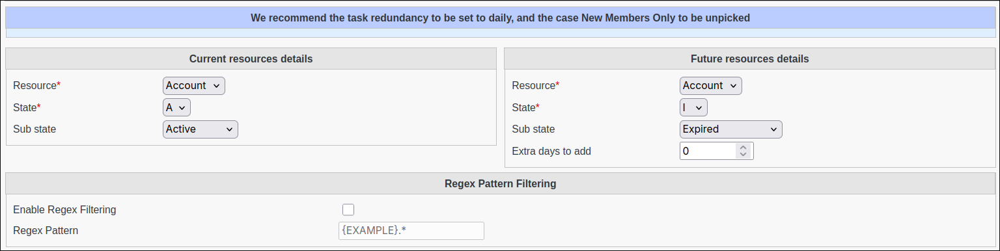

Life Cycle task
===============

The **Life Cycle** task manages the end of life of your accounts.
It uses the end date of a targeted Supann resource and allows for modification, prolongation, or change of state.

.. note::
   It must be used with FusionDirectory Orchestrator.

Task Setup
----------

Creating the Task
-----------------

   - Open the **Tasks** section of FusionDirectory
   - Define the task’s schedule and repetition interval.

   .. image:: images/lifeCycle-p1.png
      :alt: Life cycle - Task creation step 1
      :width: 600px

Configuring Life Cycle Task
---------------------------

There are two methods for configuring which resources to monitor:

**Method 1: Using Specific Resource States**

- **Navigate** to the **Tasks Life Cycle** tab.
- In the **Pre / existing resources details** section, select the resource, state, and (optionally) sub-state to monitor for expiration.
- In the **Post resources details** section, choose the resource, state, and (optionally) sub-state to be assigned after the expiration of the monitored resource.
- **Define** the extra days to extend the new resource's **end date**. The calculation begins from the last end date of the previous resource.
- **Assign** the relevant members.

**Method 2: Using Regex Pattern Filtering**

- **Navigate** to the **Regex Pattern Filtering** section.
- **Enable** the regex filtering option.
- **Enter** a regex pattern to match against supannRessourceEtatDate values.
   - Example patterns:
      - `{COMPTE}.*` to match all account resources
      - `{MAIL}A:SupannActif:.*` to match active mail resources
- Configure the **Post resources details** as described above.
- **Assign** the relevant members.

.. note::
   You can select either a **static group** or a **dynamic group** for greater flexibility.

Resource Modification Behavior
------------------------------

.. tip::
   While the task allows updating any resource based on the expiration of another, we recommend matching pre-resources with post-resources (monitoring and updating the same resource) when possible.

   This was the original intended purpose and ensures a more predictable lifecycle management.

   However, the flexibility to update different resources is available for specific use cases where needed.

When a monitored resource expires (either pre-resource or regex match), the task will:

- Look for the specified post-resource in the user's record
- If the post-resource is found and has a valid end date, it will:
  - Set the post-resource's **current end date** as its new **start date**
  - Calculate a new end date by taking the post-resource's current end date and adding any extra days specified
  - Update the post-resource with these new dates
- If not found or if the post-resource has no valid end date, the task will log an error

.. warning::
   The task modifies the POST-resource specified in the configuration, NOT the expired resource that triggered the task.
   
   The post-resource must already exist in the user's record and have a valid end date for the update to work.
   
   IMPORTANT: The current END date of the post-resource will become its new START date after the update.

.. note::
   Example: If a user has an expired {MAIL} resource and your task is configured to update {COMPTE}, the task will:
   
   1. Detect the expired {MAIL} resource 
   2. Find the existing {COMPTE} resource
   3. Update the {COMPTE} resource where its current end date becomes its new start date, and current end date + extra days becomes its new end date

Task Execution
--------------

For your configured task to be executed, you need to configure your fusiondirectory-orchestrator-client

See :ref:`Life Cycle Task Execution <lifecycle-task-execution-label>`. for more information.

Summary
-------

The **Life Cycle Task**, when configured as described, will:

- **Analyze** the Supann resources for the targeted users on a **daily basis**.
- **Check** if the configured state has expired, either using specific pre-state values or regex pattern matching.
- **If expired**, update the specified post-resource to the desired configuration.

.. note::
   This ensures automatic resource management and helps maintain up-to-date configurations.

