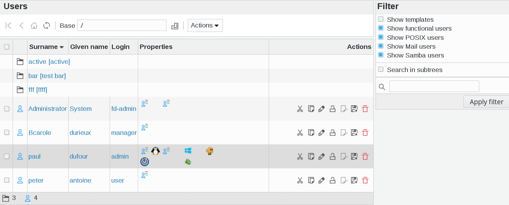
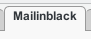
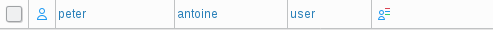
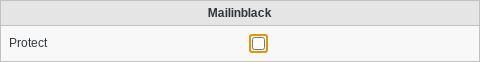
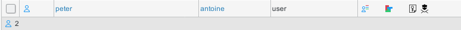

.. include:: /globals.rst

Functionalities
===============

* Edit a user

In FusionDirectory, click on users icon

This will bring you to the users overview

Click on a user and go to mailinblack tab

In this example, I selected peter antoine's profile

Activate the mailinblack tab

* Protect: Whether this user is in protect mode in Mailinblack

Click on "Apply" button bottom right

Now, if you go back to user list, you will see a new icon that defines that the mailinblack plugin is activated for your user

In FusionDirectory, you get a Mailinblack tab on users, which you should activate on users you want synchronized. Then you can check the checkbox if you want the user to be protected.

LDAP Filters
^^^^^^^^^^^^

In mailinblack use :

* ``(objectClass=fdMailInBlackUser)`` as synchronisation filter
* ``(fdMailInBlackProtect=TRUE)`` as protection filter.

